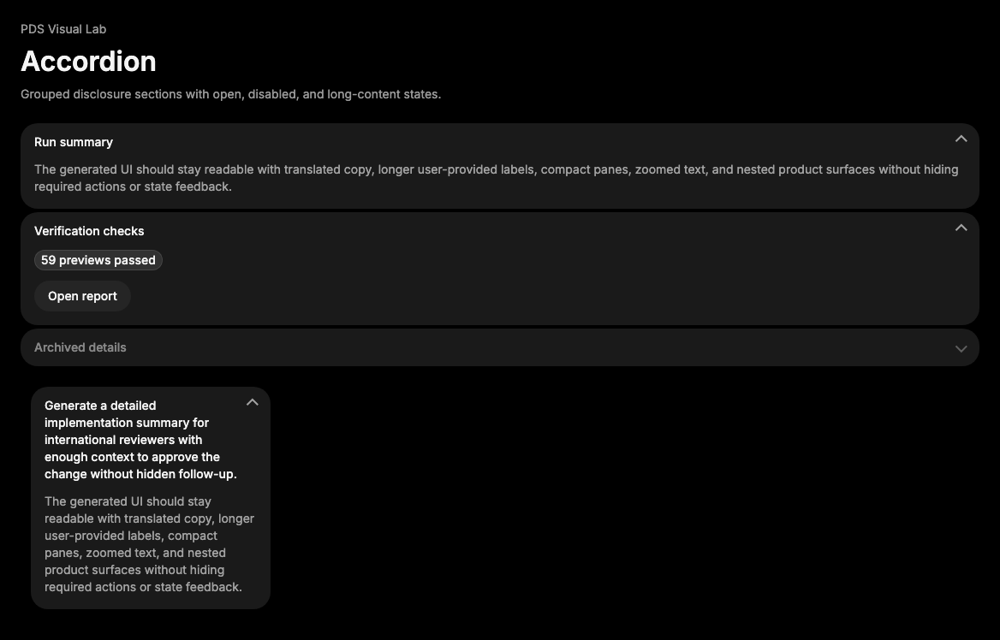

# Accordion

## Purpose

Accordion groups related disclosure sections so users can inspect one or more
chunks of supporting content without leaving the current surface.



## When To Use

- Use for repeated optional details, grouped settings, or compact inspection
  sections.
- Use when multiple disclosure items share a single control model.

## When Not To Use

- Do not use Accordion for primary required content.
- Do not use it for simple one-off disclosure; use Collapsible.

## Anatomy / Slots

```tsx
<Accordion type="single">
  <AccordionItem value="summary">
    <AccordionTrigger />
    <AccordionContent />
  </AccordionItem>
</Accordion>
```

## Public API

Exports include `Accordion`, `AccordionItem`, `AccordionTrigger`,
`AccordionContent`, and their prop types. Root behavior props are inherited from
Radix Accordion.

| Prop | Values | Default | Notes |
| --- | --- | --- | --- |
| `type` | `single`, `multiple` | Radix-owned | Controls selection model. |
| `collapsible` | boolean | Radix-owned | Allows closing the active single item. |
| `value`, `defaultValue` | string or string[] | Radix-owned | Controlled or uncontrolled open value. |

## Data Attributes

| Attribute | Values | Owner |
| --- | --- | --- |
| `data-slot` | `accordion`, `accordion-item`, `accordion-header`, `accordion-trigger`, `accordion-trigger-icon`, `accordion-content` | Component |
| `data-state` | `open`, `closed` | Radix |
| `data-disabled` | Radix disabled state | Radix |

## Accessibility Contract

Radix owns trigger button semantics, ARIA expanded state, keyboard activation,
and content association. Consumers own concise trigger text and must not hide
required errors or primary actions inside closed sections.

## Content Resilience Rules

Trigger labels and content wrap in narrow containers. Open content uses normal
layout flow so browser preview checks can verify 200% zoom without clipped
required content.

## Styling Contract

Classes use the `pds-accordion-*` prefix. CSS owns item surfaces, trigger
state-layer treatment, focus ring, chevron state, open content visibility, and
content padding.

## Token Usage

Uses color, spacing, radius, elevation, typography, state layer, focus, disabled
opacity, and motion tokens.

## State Contract

| State | Trigger | Visual treatment | Data attribute / selector | Accessibility notes |
| --- | --- | --- | --- | --- |
| Default | Normal render | Items render as stacked disclosure surfaces. | `data-slot='accordion'` | Radix owns item relationships. |
| Hover | Pointer over trigger | Neutral state-layer background. | `.pds-accordion-trigger:not(:disabled):hover` | Trigger remains a button. |
| Focus-visible | Keyboard focus on trigger | Shared PDS focus ring. | `.pds-accordion-trigger:focus-visible` | Focus remains on trigger. |
| Open | Radix open state | Chevron rotates and content is visible. | `data-state='open'` | `aria-expanded` is Radix-owned. |
| Disabled | Disabled item or trigger | Trigger dims and cannot toggle. | `:disabled`, Radix disabled state | Disabled state must not hide required content. |

Non-applicable states: Error, Loading, Success. Use section content or nearby
Alert components for those states.

## State Behavior

Accordion behavior follows Radix root props. PDS only adds stable slots, the
chevron affordance, token styling, and content wrapper spacing.

## Composition Examples

```tsx
import { Accordion, AccordionContent, AccordionItem, AccordionTrigger } from "@pds/react";

<Accordion type="single" collapsible>
  <AccordionItem value="checks">
    <AccordionTrigger>Verification checks</AccordionTrigger>
    <AccordionContent>Lint, docs, tests, and browser previews passed.</AccordionContent>
  </AccordionItem>
</Accordion>
```

## Known Limitations

- Accordion does not manage analytics or persistence.
- Accordion does not replace tabs for peer page sections.

## Do / Don't For Agents

Do:

- Use explicit trigger labels that describe the hidden content.

Don't:

- Do not hide critical validation messages only inside closed accordion items.

## Related Components

- [Collapsible](collapsible.md)
- [Card](card.md)
- [Alert](alert.md)

## Related Sources

- Component source: [packages/react/src/components/accordion.tsx](../../../packages/react/src/components/accordion.tsx)
