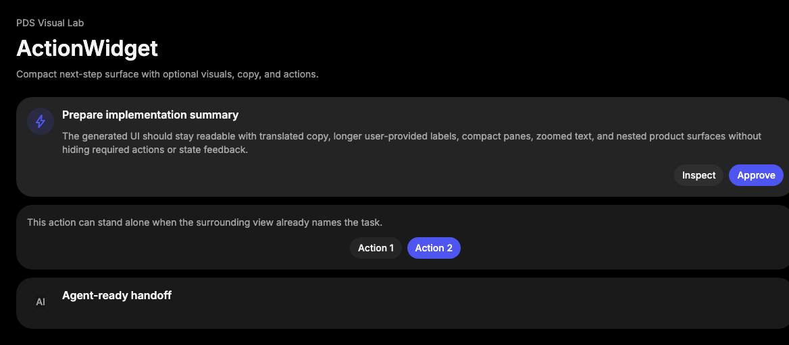

# ActionWidget

## Purpose

ActionWidget is a compact PDS surface for a short prompt, optional leading
visual, supporting copy, and one or more actions. It composes the existing
Surface visual treatment and expects interactive controls to use PDS primitives
such as Button.



## When To Use

- Use for compact recommendation, next-step, review, or setup prompts.
- Use when the content needs a grouped widget with direct actions.
- Use `ActionWidgetAvatar` for a small icon or identity primitive that supports
  the prompt.

## When Not To Use

- Do not use for long-form articles, tables, or multi-section panels; use
  Surface composition instead.
- Do not use as a replacement for Button, InlineAlert, Message, or Cell.
- Do not add product-specific fields or data loading behavior to ActionWidget.

## Anatomy / Slots

```tsx
<ActionWidget>
  <ActionWidgetAvatar />
  <ActionWidgetTitle />
  <ActionWidgetContent />
  <ActionWidgetActions />
</ActionWidget>
```

Slots are optional. Preserve the intended order when multiple slots are present.

The root also exposes compound members for migration-friendly composition:

```tsx
<ActionWidget>
  <ActionWidget.Title />
  <ActionWidget.Avatar />
  <ActionWidget.Content />
  <ActionWidget.Actions />
</ActionWidget>
```

## Public API

| Export | Notes |
| --- | --- |
| `ActionWidget` | Root Surface-backed widget; accepts `level`. |
| `ActionWidgetTitle` | Primary title slot. |
| `ActionWidgetAvatar` | Leading visual slot for Icon, Avatar, or similar PDS primitives. |
| `ActionWidgetContent` | Supporting body copy slot. |
| `ActionWidgetActions` | Action row slot; accepts `justify`. |

| Prop | Values | Default | Notes |
| --- | --- | --- | --- |
| `level` | `base`, `nested`, `elevated` | `base` | Reuses Surface hierarchy levels. |
| `justify` | `start`, `center`, `end` | `end` | `ActionWidgetActions` alignment. |

All exports forward refs, preserve `className`, and pass native attributes to
their rendered elements.

## Data Attributes

| Attribute | Values | Owner |
| --- | --- | --- |
| `data-slot` | `action-widget` | `ActionWidget` |
| `data-level` | `base`, `nested`, `elevated` | `ActionWidget` |
| `data-slot` | `action-widget-title` | `ActionWidgetTitle` |
| `data-slot` | `action-widget-avatar` | `ActionWidgetAvatar` |
| `data-slot` | `action-widget-content` | `ActionWidgetContent` |
| `data-slot` | `action-widget-actions` | `ActionWidgetActions` |
| `data-justify` | `start`, `center`, `end` | `ActionWidgetActions` |

## Accessibility Contract

ActionWidget is structural and renders a neutral `div` through Surface. Consumers
own section labels, heading levels, landmarks, and any live-region behavior.

Use PDS Button for actions so native keyboard and focus behavior stays owned by
the action primitive. Icon-only actions still require an accessible name on the
Button. Visuals in `ActionWidgetAvatar` should be decorative unless identity or
state is not otherwise named nearby.

## Content Resilience Rules

ActionWidget fills the available container width by default. Title, content, and
actions wrap by default. Long action labels remain available through Button
behavior, and the action row wraps in narrow containers and at 200% zoom.

`ActionWidgetAvatar` is compact and should contain fixed-size visual primitives.
Long identity labels belong in the title or content slots, not inside the avatar
slot.

## Styling Contract

The root class is `pds-action-widget`; slot classes use the
`pds-action-widget-*` prefix. Styling lives in
`packages/react/src/components.css`.

ActionWidget composes Surface classes and overrides the internal layout to a
compact grid. Preserve the ActionWidget selectors and Surface-backed `data-level`
behavior when changing the DOM.

## Token Usage

ActionWidget uses PDS surface color, spacing, radius, elevation, typography, and
content resilience tokens. Icon treatment inside the avatar slot uses action and
accent token roles, not brand palette colors.

## State Contract

| State | Trigger | Visual treatment | Data attribute / selector | Accessibility notes |
| --- | --- | --- | --- | --- |
| Default | Normal render | Widget surface uses its `level` and action alignment treatment. | `data-slot='action-widget'`, `data-level`, `data-justify` | ActionWidget is structural; children own semantics. |

Non-applicable states: Hover, Focus-visible, Active, Disabled, Loading, Error, Success. Use child components or the surrounding region for those states when needed.

## State Behavior

ActionWidget has no interactive state of its own. Interactive states belong to
children such as Button, Menu, or Popover triggers.

## Composition Examples

```tsx
import {
  ActionWidget,
  ActionWidgetActions,
  ActionWidgetAvatar,
  ActionWidgetContent,
  ActionWidgetTitle,
  Button,
  Icon
} from "@pds/react";

<ActionWidget>
  <ActionWidgetAvatar>
    <Icon name="bolt" />
  </ActionWidgetAvatar>
  <ActionWidgetTitle>Prepare run summary</ActionWidgetTitle>
  <ActionWidgetContent>
    Review generated context before handing work back.
  </ActionWidgetContent>
  <ActionWidgetActions>
    <Button intent="secondary">Inspect</Button>
    <Button>Approve</Button>
  </ActionWidgetActions>
</ActionWidget>
```

## Known Limitations

- ActionWidget does not enforce one primary action.
- ActionWidget does not provide loading, disclosure, or selection behavior.
- ActionWidget does not infer heading semantics from `ActionWidgetTitle`.

## Do / Don't For Agents

Do:

- Use PDS primitives inside slots.
- Preserve `data-slot`, `data-level`, and `data-justify`.
- Keep copy available and wrapping in compact layouts.

Don't:

- Do not import upstream fixture helpers or third-party design-system tokens.
- Do not hard-code colors, spacing, radii, shadows, or typography.
- Do not add component-specific action button APIs.

## Related Components

- [Surface](surface.md)
- [Button](button.md)
- [Icon](icon.md)
- [Avatar](avatar.md)
- [InlineAlert](inline-alert.md)

## Related Sources

- Component source: [packages/react/src/components/action-widget.tsx](../../../packages/react/src/components/action-widget.tsx)
