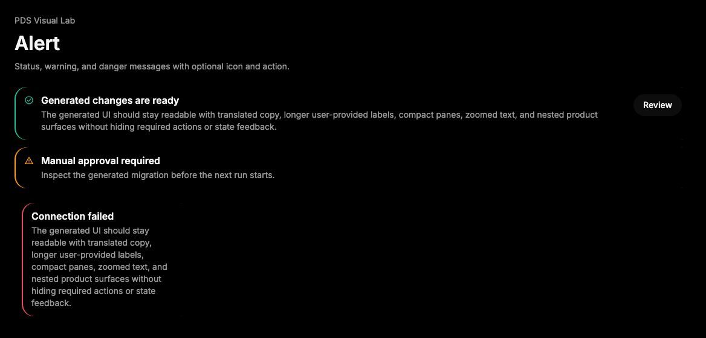

# Alert

## Purpose

Alert presents an immediate message with optional icon and action when users
need to notice status, warning, or corrective information in context.



## When To Use

- Use for product messages that need alert semantics and a structured title,
  description, and optional action.
- Use for warning or danger states that should be announced to assistive
  technology.

## When Not To Use

- Do not use Alert for passive helper text; use FieldDescription or nearby copy.
- Do not use Alert for transient notifications; use Toast.

## Anatomy / Slots

```tsx
<Alert>
  <Icon />
  <AlertTitle />
  <AlertDescription />
  <AlertAction />
</Alert>
```

## Public API

Exports include `Alert`, `AlertTitle`, `AlertDescription`, `AlertAction`, and
their prop types.

| Prop | Values | Default | Notes |
| --- | --- | --- | --- |
| `tone` | `neutral`, `success`, `warning`, `danger` | `neutral` | Controls the leading status accent and icon color. |
| `role` | HTML role | `alert` | Override to `status` only for non-urgent updates. |

## Data Attributes

| Attribute | Values | Owner |
| --- | --- | --- |
| `data-slot` | `alert`, `alert-title`, `alert-description`, `alert-action` | Component |
| `data-tone` | `neutral`, `success`, `warning`, `danger` | Component |

## Accessibility Contract

Alert defaults to `role="alert"`. Consumers may set `role="status"` for
non-urgent neutral or success updates. Icon-only actions inside `AlertAction`
must have accessible names, and visible error or warning text must remain in the
title or description.

## Content Resilience Rules

Alert text wraps in narrow containers and at 200% zoom. Keep actions short and
move detailed remediation steps into `AlertDescription` or adjacent content.

## Styling Contract

Classes use the `pds-alert-*` prefix. CSS owns the grid, optional leading icon
placement, action placement, tone accent, responsive stacking, and text
wrapping.

## Token Usage

Uses color, status color, spacing, radius, elevation, typography, and divider
tokens.

## State Contract

| State | Trigger | Visual treatment | Data attribute / selector | Accessibility notes |
| --- | --- | --- | --- | --- |
| Default | Normal render | Neutral alert surface with title, description, optional icon, and optional action. | `data-slot='alert'`, `data-tone='neutral'` | Defaults to `role='alert'`. |
| Success | `tone='success'` | Success status accent and icon color. | `data-tone='success'` | Use `role='status'` for non-urgent success. |
| Warning | `tone='warning'` | Warning status accent and icon color. | `data-tone='warning'` | Alert role is usually appropriate. |
| Danger | `tone='danger'` | Danger status accent and icon color. | `data-tone='danger'` | Pair with visible remediation when possible. |

Non-applicable states: Hover, Active, Disabled, Loading. Child actions own their
own interactive states.

## State Behavior

Alert does not manage dismissal or timing. Tone only changes status treatment;
children own interactive behavior.

## Composition Examples

```tsx
import { Alert, AlertDescription, AlertTitle, Icon } from "@pds/react";

<Alert tone="warning">
  <Icon name="warning" />
  <AlertTitle>Review required</AlertTitle>
  <AlertDescription>One generated change needs human approval.</AlertDescription>
</Alert>
```

## Known Limitations

- Alert does not auto-dismiss.
- Alert does not replace field-level validation wiring.

## Do / Don't For Agents

Do:

- Use explicit text for the condition and next step.

Don't:

- Do not rely on tone color or icon alone to communicate the message.

## Related Components

- [InlineAlert](inline-alert.md)
- [Toast](toast.md)
- [Field](field.md)

## Related Sources

- Component source: [packages/react/src/components/alert.tsx](../../../packages/react/src/components/alert.tsx)
