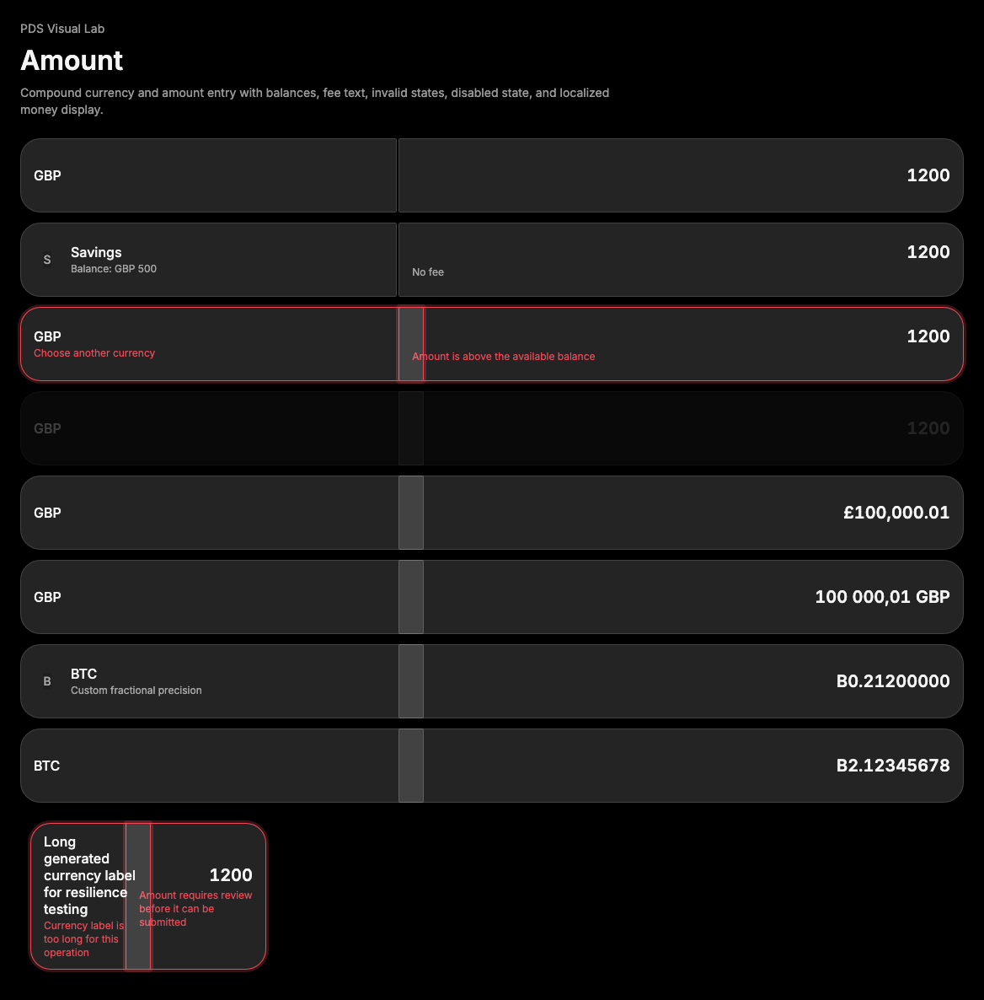

# Amount

## Purpose

Amount is a compound money-entry field for pairing a selectable currency or asset
side with a numeric amount side. It composes existing PDS primitives so product
surfaces can present balances, fees, invalid states, disabled states, and
localized money display without building a one-off field layout.



## When To Use

- Use when a value entry needs a left currency, account, or asset selector and a
  right amount input.
- Use `Amount.Input` money modes for display formatting of controlled numeric
  values.
- Use `CurrencyProvider` only for custom currencies or assets that need
  non-default fraction digits or symbols.

## When Not To Use

- Do not use Amount for a standalone text field; use [Input](input.md).
- Do not use Amount for a full transaction form by itself; compose it inside a
  form with labels, submit actions, and validation summary as needed.
- Do not use remote brand-specific asset URLs in examples or component fixtures.

## Anatomy / Slots

```tsx
<Amount>
  <Amount.Currency value="GBP" />
  <Amount.Input currency="GBP" type={AmountInputType.MONEY} />
</Amount>
```

Exported parts:

- `Amount`: root two-column grouping.
- `Amount.Currency` / `AmountCurrency`: currency or asset side, internally based
  on `Cell`.
- `Amount.Input` / `AmountInput`: amount side, internally based on `Input`.
- `AmountInputType`: `TEXT`, `MONEY`, and `MONEY_FRACTIONAL`.
- `IntlProvider`: locale provider for formatting.
- `CurrencyProvider`: custom currency metadata provider.

## Public API

| Prop | Values | Default | Notes |
| --- | --- | --- | --- |
| `Amount.invalid` | `boolean` | `false` | Adds invalid root data state and `aria-invalid`. |
| `Amount.Currency.value` | `ReactNode` | required | Primary currency, account, or asset label. |
| `Amount.Currency.description` | `ReactNode` | `undefined` | Supporting balance or metadata. |
| `Amount.Currency.image` | `string`, `ReactNode` | `undefined` | Decorative image or custom node. String images use Avatar fallback. |
| `Amount.Currency.invalid` | `boolean` | `false` | Adds invalid state and error styling. |
| `Amount.Currency.errorMessage` | `ReactNode` | `undefined` | Visible validation text for the currency side. |
| `Amount.Input.type` | `AmountInputType` | `TEXT` | Selects raw text, major-unit money, or minor-unit money formatting. |
| `Amount.Input.currency` | currency code | `undefined` | Used for money formatting. |
| `Amount.Input.value` | `number`, `string` | `undefined` | Controlled value. Money modes format numeric values for display. |
| `Amount.Input.defaultValue` | `number`, `string` | `undefined` | Initial value, formatted like `value`. |
| `Amount.Input.description` | `ReactNode` | `undefined` | Supporting fee or helper text. |
| `Amount.Input.invalid` | `boolean` | `false` | Adds invalid state and `aria-invalid`. |
| `Amount.Input.errorMessage` | `ReactNode` | `undefined` | Visible validation text for the input side. |
| `Amount.Input.showSign` | `boolean` | `false` | Shows plus signs for positive formatted values. |
| `Amount.Input.negative` | `boolean` | `false` | Displays the numeric value as negative. |
| `Amount.Input.showCurrency` | `boolean` | `true` | Hides the currency symbol/code when false. |

`Amount.Currency` preserves `Cell` passthrough props such as `use`, `disabled`,
`onClick`, and `aria-*`. `Amount.Input` preserves native input attributes except
for the overloaded `type`, `value`, and `defaultValue` props.

## Data Attributes

| Attribute | Values | Owner |
| --- | --- | --- |
| `data-slot` | `amount` | Amount |
| `data-slot` | `amount-currency` | Amount.Currency |
| `data-slot` | `amount-currency-image` | Amount.Currency |
| `data-slot` | `amount-currency-value` | Amount.Currency |
| `data-slot` | `amount-currency-description` | Amount.Currency |
| `data-slot` | `amount-currency-error` | Amount.Currency |
| `data-slot` | `amount-input` | Amount.Input wrapper |
| `data-slot` | `amount-input-control` | Amount.Input control |
| `data-slot` | `amount-input-description` | Amount.Input |
| `data-slot` | `amount-input-error` | Amount.Input |
| `data-invalid` | `true` when invalid | Component |
| `data-disabled` | `true` when `Amount.Input` is disabled | Component |

## Accessibility Contract

Amount does not create a form label. Consumers must provide visible labels,
`aria-label`, or `aria-labelledby` for both the currency side and input side.

`Amount.Currency` renders a `div` by default and a `button` when `onClick` is
provided unless consumers override `use`. Interactive currency sides should have
an accessible name and use native button behavior when possible.

`Amount.Input` renders a native text input. It wires description and error
message IDs into `aria-describedby` and maps `invalid` to `aria-invalid`. Money
formatting is display-oriented; consumers still own parsing, validation, and
submission behavior.

## Content Resilience Rules

Amount is boundless by default. Currency labels, descriptions, and error
messages wrap instead of truncating. At compact viewport widths, the two sides
stack so long translated labels and validation text remain visible. Numeric
input text uses tabular figures and remains editable as native input text.

Follow [content resilience](../../foundations/content-resilience.md): do not
truncate required labels, error messages, or state feedback.

## Styling Contract

Styling lives in `packages/react/src/components.css`.

CSS depends on `pds-amount`, `pds-amount-currency`, `pds-amount-input`,
`pds-amount-input-control`, `data-invalid`, `data-disabled`, `aria-invalid`,
`:focus-visible`, and `:focus-within`. Preserve the internal `Cell`, `Input`,
and `Avatar` composition when changing DOM so Amount continues to use primitive
atoms rather than duplicate their behavior.

## Token Usage

Amount uses PDS color, spacing, radius, typography, focus, invalid state,
interaction layer, disabled opacity, and motion tokens. Do not add hard-coded
colors, spacing, radii, transitions, or brand-specific asset references.

## State Contract

| State | Trigger | Visual treatment | Data attribute / selector | Accessibility notes |
| --- | --- | --- | --- | --- |
| Default | Normal render | Currency side and input side render as a grouped amount control. | `data-slot='amount'`, `amount-currency`, `amount-input` | Consumers provide labels and descriptions for the input and grouped context. |
| Hover | Pointer hover | Currency cell and input wrapper use hover state layer when enabled. | `.pds-amount-currency.pds-cell:hover`, `.pds-amount-input:not([data-disabled='true']):hover` | Hover does not change form semantics. |
| Focus-visible | Keyboard focus | Currency focus and input focus-within use the shared PDS focus shadow. | `.pds-amount-currency:focus-visible`, `.pds-amount-input:focus-within` | Input focus remains on the native input control. |
| Active | Pressed | Currency cell uses Cell pressed treatment when interactive; input has no pressed state. | `.pds-amount-currency.pds-cell:active` | Activation semantics come from the rendered currency root. |
| Disabled | `disabled` / `aria-disabled` | Disabled input dims the wrapper; disabled currency follows Cell disabled treatment. | `data-disabled='true'`, `:disabled`, `aria-disabled` | Native input disabled prevents editing; non-button currency roots use `aria-disabled`. |
| Error | `data-invalid` / error prop | Invalid root, currency, and input use invalid border and error text treatment. | `data-invalid='true'`, `aria-invalid='true'` | Invalid input sets or preserves `aria-invalid`; error text must remain visible. |

Non-applicable states: Loading, Success. Use child components or the surrounding region for those states when needed.

## State Behavior

- `Amount.invalid` marks the root for grouped invalid state.
- `Amount.Currency.invalid` sets `aria-invalid` and invalid styling on the left
  side.
- `Amount.Input.invalid` sets `aria-invalid` on the native input and invalid
  styling on the right side.
- Disabled `Amount.Currency` follows `Cell` disabled behavior.
- Disabled `Amount.Input` uses native disabled input behavior and dims the
  wrapper.

## Composition Examples

```tsx
import { Amount, AmountInputType } from "@pds/react";

<Amount>
  <Amount.Currency aria-label="Currency" value="GBP" />
  <Amount.Input
    aria-label="Amount"
    currency="GBP"
    type={AmountInputType.MONEY}
    value={1200}
  />
</Amount>;
```

```tsx
import { Amount, AmountInputType, CurrencyProvider } from "@pds/react";

<CurrencyProvider
  currencies={[{ code: "BTC", fractionalPart: 8, symbol: "B" }]}
>
  <Amount>
    <Amount.Currency aria-label="Asset" value="BTC" />
    <Amount.Input
      aria-label="Amount"
      currency="BTC"
      type={AmountInputType.MONEY_FRACTIONAL}
      value={212345678}
    />
  </Amount>
</CurrencyProvider>;
```

## Known Limitations

- Amount does not parse formatted input text back into numeric values.
- Amount does not provide menus for selecting currencies or assets.
- Amount does not own form labels, submit behavior, or validation summaries.

## Do / Don't For Agents

Do:

- Keep Amount composed from existing PDS primitives.
- Preserve localized formatting behavior and custom currency metadata.
- Keep all examples free from brand-specific remote asset references.

Don't:

- Do not duplicate Input or Cell state behavior inside Amount.
- Do not truncate error messages or balance descriptions.
- Do not add a new layout primitive just to support Amount examples.

## Related Components

- [Input](input.md)
- [Cell](cell.md)
- [Avatar](avatar.md)

## Related Sources

- Component source: [packages/react/src/components/amount.tsx](../../../packages/react/src/components/amount.tsx)
