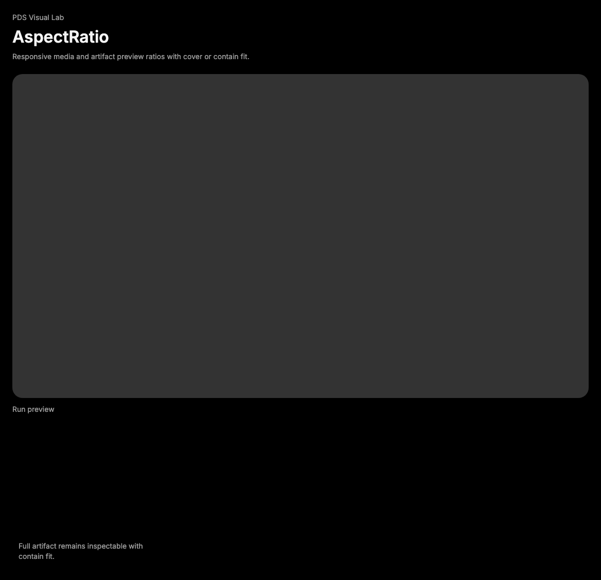

# AspectRatio

## Purpose

AspectRatio preserves a fixed media or preview ratio while keeping embedded
content responsive inside PDS product surfaces.



## When To Use

- Use for screenshots, thumbnails, video previews, generated artifacts, or media
  cards that need a stable ratio.
- Use `fit="contain"` when the full asset must remain inspectable.

## When Not To Use

- Do not use AspectRatio to impose fixed heights on text-heavy content.
- Do not use it as a generic card or surface wrapper.

## Anatomy / Slots

```tsx
<AspectRatio ratio={16 / 9}>
  
</AspectRatio>
```

## Public API

Exports include `AspectRatio` and `AspectRatioProps`. It accepts Radix
AspectRatio root props and forwards refs.

| Prop | Values | Default | Notes |
| --- | --- | --- | --- |
| `ratio` | number | Radix default | Width divided by height. |
| `fit` | `cover`, `contain` | `cover` | Sets object fit on direct media children. |

## Data Attributes

| Attribute | Values | Owner |
| --- | --- | --- |
| `data-slot` | `aspect-ratio` | Component |
| `data-fit` | `cover`, `contain` | Component |

## Accessibility Contract

AspectRatio owns layout only. Consumers must provide accessible names for media,
iframes, or interactive content inside it.

## Content Resilience Rules

Use AspectRatio for media and fixed-format previews, not text blocks. Choose
`fit="contain"` when cropping would hide required information.

## Styling Contract

The root class is `pds-aspect-ratio`. CSS sets clipping, radius, background, and
direct-media object fit.

## Token Usage

Uses surface color and radius tokens.

## State Contract

| State | Trigger | Visual treatment | Data attribute / selector | Accessibility notes |
| --- | --- | --- | --- | --- |
| Cover | `fit="cover"` | Direct media fills the ratio and may crop. | `data-fit='cover'` | Use only when cropping is acceptable. |
| Contain | `fit="contain"` | Direct media remains fully visible inside the ratio. | `data-fit='contain'` | Prefer for inspectable generated artifacts. |

Non-applicable states: Hover, Focus-visible, Active, Disabled, Loading, Error.
Use children or surrounding regions for those states.

## State Behavior

AspectRatio delegates ratio math to Radix. The `fit` prop changes direct media
object-fit styling only.

## Composition Examples

```tsx
import { AspectRatio } from "@pds/react";

<AspectRatio fit="contain" ratio={4 / 3}>
  
</AspectRatio>
```

## Known Limitations

- AspectRatio does not lazy-load media or provide fallback content.

## Do / Don't For Agents

Do:

- Preserve inspectability for screenshots and generated artifacts.

Don't:

- Do not crop content that users need to verify.

## Related Components

- [Surface](surface.md)
- [TravelWidget](travel-widget.md)
- [Empty](empty.md)

## Related Sources

- Component source: [packages/react/src/components/aspect-ratio.tsx](../../../packages/react/src/components/aspect-ratio.tsx)
