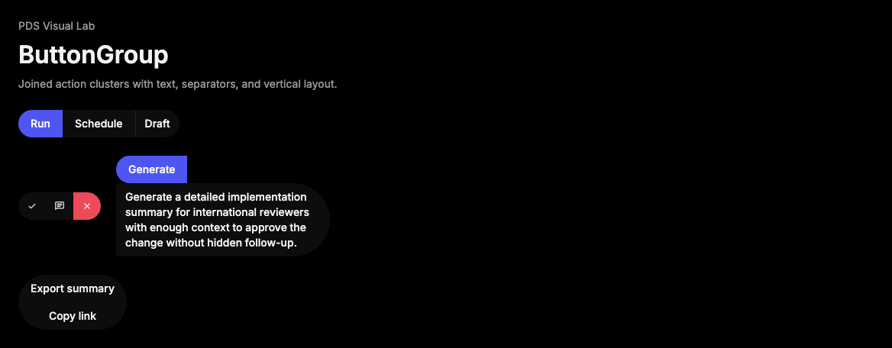

# ButtonGroup

## Purpose

ButtonGroup joins related actions, segmented action rows, or compact command
clusters while preserving each child control's native behavior.



## When To Use

- Use when several buttons operate on the same object or workflow step.
- Use when a short label or separator must sit inside the same action cluster.

## When Not To Use

- Do not use ButtonGroup as page navigation; use Tabs, Breadcrumbs, or
  Pagination.
- Do not use it for mutually exclusive toggle state; use ToggleGroup.

## Anatomy / Slots

```tsx
<ButtonGroup>
  <Button />
  <ButtonGroupSeparator />
  <ButtonGroupText />
</ButtonGroup>
```

## Public API

Exports include `ButtonGroup`, `ButtonGroupText`, `ButtonGroupSeparator`, and
their prop types, including `ButtonGroupSeparatorProps`.

| Prop | Values | Default | Notes |
| --- | --- | --- | --- |
| `orientation` | `horizontal`, `vertical` | `horizontal` | Controls the joining axis. |
| `role` | HTML role | `group` | Override only when surrounding semantics already provide grouping. |
| `asChild` on `ButtonGroupText` | boolean | `false` | Renders text styling on a child element. |

## Data Attributes

| Attribute | Values | Owner |
| --- | --- | --- |
| `data-slot` | `button-group`, `button-group-text`, `button-group-separator` | Component |
| `data-orientation` | `horizontal`, `vertical` | Component |

## Accessibility Contract

ButtonGroup renders a `role="group"` container by default. Consumers own an
accessible group label when the relationship is not obvious from surrounding
content. Child Button, Separator, and custom children own their own semantics.

## Content Resilience Rules

ButtonGroup can wrap in horizontal orientation and stacks in vertical
orientation. Keep action labels concise because Button itself remains
fixed-height and single-line; use ButtonGroupText or surrounding copy for longer
context.

## Styling Contract

Classes use the `pds-button-group-*` prefix. CSS owns joining radii for direct
Button, InputGroup, NativeSelect wrapper, and ButtonGroupText children. Preserve
`data-orientation` selectors when changing layout behavior.

## Token Usage

Uses spacing, radius, color, typography, divider, and state tokens through child
components.

## State Contract

| State | Trigger | Visual treatment | Data attribute / selector | Accessibility notes |
| --- | --- | --- | --- | --- |
| Default | Normal render | Children are visually joined along the selected orientation. | `data-slot='button-group'`, `data-orientation` | Container groups related child controls. |
| Disabled | Disabled child controls | Disabled appearance is owned by each child component. | Child selectors | Group does not disable children by itself. |

Non-applicable states: Loading, Error, Success, Pressed. Use child controls or
the surrounding region for those states.

## State Behavior

ButtonGroup does not manage selection, pressed state, or roving focus. It only
sets grouping semantics, orientation metadata, and styling hooks.

## Composition Examples

```tsx
import { Button, ButtonGroup, ButtonGroupSeparator, ButtonGroupText } from "@pds/react";

<ButtonGroup aria-label="Run actions">
  <Button>Run</Button>
  <Button intent="secondary">Schedule</Button>
  <ButtonGroupSeparator />
  <ButtonGroupText>Draft</ButtonGroupText>
</ButtonGroup>
```

## Known Limitations

- ButtonGroup does not manage mutually exclusive state.
- ButtonGroup does not automatically label the group.

## Do / Don't For Agents

Do:

- Keep grouped actions related to one task or object.

Don't:

- Do not place unrelated page-level commands in one ButtonGroup.

## Related Components

- [Button](button.md)
- [ToggleGroup](toggle-group.md)
- [Separator](separator.md)

## Related Sources

- Component source: [packages/react/src/components/button-group.tsx](../../../packages/react/src/components/button-group.tsx)
