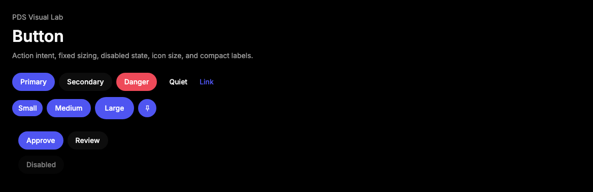

# Button

## Purpose

Button is the PDS action primitive for agent-facing product surfaces. It
provides token-first visual treatment, stable state attributes, native button
behavior, and optional `asChild` composition for links or custom interactive
elements.



## When To Use

- Use for actions that run, submit, approve, cancel, inspect, navigate, or expose
  an explicit command.
- Use `intent="primary"` for the main action in a local surface.
- Use `intent="secondary"` for supporting actions.
- Use `intent="quiet"` for lower-emphasis actions that should remain available.
- Use `intent="danger"` only for destructive or high-risk actions.
- Use `intent="link"` when the action should visually read as inline navigation.

## When Not To Use

- Do not use Button as a badge, status chip, text label, or layout container.
- Do not use `intent="danger"` for warnings or non-destructive emphasis.
- Do not create icon-only buttons without an accessible name.
- Do not use `asChild` to bypass native interactive semantics; the child must
  own the correct role, href, disabled behavior, or keyboard behavior.

## Anatomy / Slots

Button has one public root slot.

```tsx
<Button>Run agent</Button>
```

Optional icons can be placed inside the button. Icons should use `data-icon` so
the package stylesheet can size them consistently.

```tsx
<Button>
  <Icon name="add" />
  Run agent
</Button>
```

## Public API

| Prop | Values | Default | Notes |
| --- | --- | --- | --- |
| `intent` | `primary`, `secondary`, `danger`, `quiet`, `link` | `primary` | Maps to visual action intent. |
| `size` | `sm`, `md`, `lg`, `icon` | `md` | Controls spacing and minimum size. |
| `asChild` | `boolean` | `false` | Renders through Radix `Slot.Root`. |
| `type` | Native button type | `button` | Applied only when rendering a native `button`. |

Button extends native `button` attributes, forwards refs, and preserves
`className`.

## Data Attributes

| Attribute | Values | Owner |
| --- | --- | --- |
| `data-slot` | `button` | Component |
| `data-intent` | `primary`, `secondary`, `danger`, `quiet`, `link` | Component |
| `data-size` | `sm`, `md`, `lg`, `icon` | Component |
| `data-icon` | Empty marker on child icon | Consumer |

## Accessibility Contract

Native Button renders a `button` and defaults to `type="button"` to avoid
accidental form submission. Consumers can pass `type="submit"` when the button
is intentionally part of a form.

Disabled native buttons use the native `disabled` attribute. If a consumer uses
`aria-disabled`, the consumer owns preventing activation.

Icon-only buttons must provide an accessible name with `aria-label`,
`aria-labelledby`, or hidden text. Link buttons rendered with `asChild` should
use a real anchor with `href`.

## Content Resilience Rules

Button sizes are fixed-height and labels render as a single line. Keep action
copy concise; do not put explanatory, sentence-length, or multi-line content in
Button. Put supporting context beside the button or in the surrounding surface
when the action needs more explanation.

The full label must stay in the DOM for assistive technology, but the visual
button must not grow taller to absorb long copy. Do not rely on Button wrapping
for translation, narrow containers, or 200% zoom.

`size="icon"` is the square fixed-size variant. It should contain an icon or
compact accessible affordance, not long text.

## Styling Contract

The root class is `pds-button`; styling lives in
`packages/react/src/components.css`.

CSS depends on `data-intent`, `data-size`, native `:disabled`, optional
`[aria-disabled="true"]`, `:hover`, `:active`, and `:focus-visible`. Preserve
those selectors when changing implementation details.

## Token Usage

Button uses PDS typography, spacing, radius, color, elevation focus, interaction
state layer, disabled opacity, and motion tokens. Use semantic token categories
instead of adding one-off colors, spacing, radii, transitions, or shadows.

## State Contract

| State | Trigger | Visual treatment | Data attribute / selector | Accessibility notes |
| --- | --- | --- | --- | --- |
| Default | Normal render | Button uses intent, size, and tokenized action surface treatment. | `data-slot='button'`, `data-intent`, `data-size` | Native button defaults to `type='button'`; `asChild` child owns semantics. |
| Hover | Pointer hover | Enabled buttons apply intent-specific state layer or link underline. | `.pds-button:not(:disabled, [aria-disabled='true']):hover` | Hover is suppressed for disabled and aria-disabled buttons. |
| Focus-visible | Keyboard focus | Shared PDS focus shadow appears around the button. | `.pds-button:focus-visible` | Keyboard focus remains on the button or composed child. |
| Active | Pressed | Enabled buttons apply pressed state layer. | `.pds-button:not(:disabled, [aria-disabled='true']):active` | Native button activation remains browser-owned. |
| Disabled | `disabled` / `aria-disabled` | Disabled buttons use disabled opacity and suppress hover or active treatment. | `:disabled`, `[aria-disabled='true']` | Native disabled prevents activation; `aria-disabled` consumers must prevent activation. |
| Error | `data-invalid` / error prop | Danger intent uses destructive action colors, not form invalid styling. | `data-intent='danger'` | Danger is not an error announcement. |

Non-applicable states: Loading, Success. Use child components or the surrounding region for those states when needed.

## State Behavior

- Hover and active treatments are suppressed for native disabled buttons and
  `[aria-disabled="true"]`.
- Focus uses the shared PDS focus shadow.
- Solid primary and danger intents layer shared on-solid state tokens over the
  base fill.
- Secondary and quiet intents use neutral state layer tokens.
- Link intent uses underline on hover instead of a filled background.

## Composition Examples

```tsx
import { Button, Icon } from "@pds/react";

<Button>Run agent</Button>
<Button intent="secondary">View details</Button>
<Button intent="danger">Delete run</Button>
<Button aria-label="Create run" size="icon">
  <Icon name="add" />
</Button>
<Button asChild intent="link">
  <a href="/runs">View runs</a>
</Button>
```

## Known Limitations

- Button does not provide loading spinners or busy state.
- Button does not enforce single-primary-action layout rules.
- Button does not polyfill disabled behavior for non-button `asChild` children.

## Do / Don't For Agents

Do:

- Preserve `data-slot`, `data-intent`, and `data-size`.
- Keep labels concise and single-line.
- Preserve the fixed-height sizing contract.
- Use `intent="danger"` only for destructive actions.
- Add tests when changing public props, default behavior, or state selectors.

Don't:

- Do not add Tailwind, CVA, shadcn variants, or hard-coded visual values.
- Do not change the default native `type="button"` without updating tests and
  docs.
- Do not put explanatory or sentence-length copy inside Button.
- Do not add component-specific hover color tokens unless the shared state layer
  model cannot express the behavior.

## Related Components

- [Composer](composer.md)
- [Surface](surface.md)
- [Message](message.md)

## Related Sources

- Component source: [packages/react/src/components/button.tsx](../../../packages/react/src/components/button.tsx)
