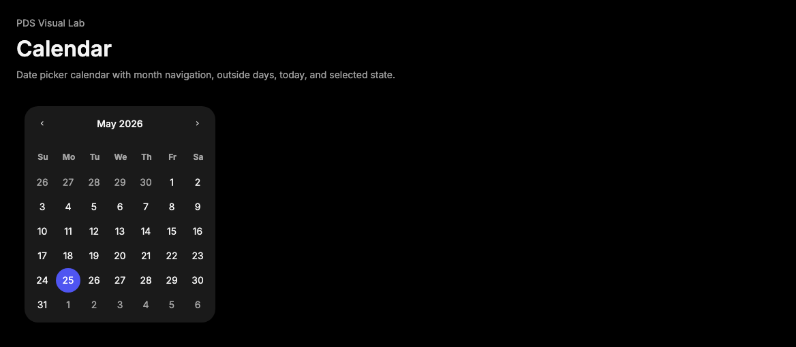

# Calendar

## Purpose

Calendar provides a `react-day-picker` backed date picker surface with PDS
tokens, day/range state hooks, navigation controls, and singular
`data-slot="calendar"` compatibility from `temp-ext-v4`.



## When To Use

- Use for choosing dates or date ranges in forms, popovers, sheets, and filters.
- Use with DayPicker props such as `mode`, `selected`, `month`, `disabled`, and
  `onSelect`.
- Use `buttonVariant` to map day buttons onto a PDS Button intent.

## When Not To Use

- Do not use for free-form date entry; pair Input with validation.
- Do not use for dense scheduling timelines.
- Do not hard-code day colors outside the component CSS.

## Anatomy / Slots

```tsx
<Calendar mode="single" selected={date} onSelect={setDate} />
```

## Public API

Exports include `Calendar`, `CalendarDayButton`, `CalendarProps`, and
`CalendarDayButtonProps`. `CalendarProps` extends DayPicker props and adds
`buttonVariant?: ButtonIntent`.

## Data Attributes

| Attribute | Values | Owner |
| --- | --- | --- |
| `data-slot` | `calendar` | Component |
| `data-day` | localized date string | Component |
| `data-selected-single`, `data-range-start`, `data-range-middle`, `data-range-end` | `true` when active | Component |
| DayPicker state attributes/classes | DayPicker values | DayPicker |

## Accessibility Contract

DayPicker owns grid semantics, month navigation labels, date button labels, and
selection behavior. Consumers must provide controlled selection state and labels
around the field when the calendar is part of a form.

## Content Resilience Rules

Calendar is width-fit but scrolls if embedded in a narrow container. Localized
month/day labels must remain visible; do not add fixed-width wrappers that clip
the calendar.

## Styling Contract

Classes use the `pds-calendar-*` prefix. CSS owns month layout, navigation
buttons, day button shape, today, outside, disabled, single selection, and range
state treatments.

## Token Usage

Uses surface, foreground, accent, state layer, disabled opacity, spacing,
radius, focus, typography, and motion tokens.

## State Contract

| State | Trigger | Visual treatment | Selector | Accessibility notes |
| --- | --- | --- | --- | --- |
| Default | Normal day | Quiet square button. | `.pds-calendar-day-button` | DayPicker provides the accessible label. |
| Today | Current day | Neutral state layer. | `.pds-calendar-today` | Selection remains separate from today. |
| Selected | Single selected day | Accent fill and on-accent text. | `[data-selected-single="true"]` | DayPicker exposes selected state. |
| Range | Range start/middle/end | Accent endpoints and selected middle layer. | `[data-range-*="true"]` | Use DayPicker range mode. |
| Disabled | Disabled date | Disabled opacity and no activation. | `.pds-calendar-disabled` | DayPicker owns disabled behavior. |
| Focus-visible | Keyboard focus | Shared PDS focus shadow. | `.pds-calendar-day-button:focus-visible` | Keep keyboard navigation enabled. |

## State Behavior

`CalendarDayButton` focuses the DayPicker-focused day and mirrors range/single
selection modifiers onto stable data attributes.

## Composition Examples

```tsx
import { Calendar } from "@pds/react";

<Calendar mode="single" selected={date} onSelect={setDate} />;
```

## Known Limitations

- Calendar does not parse typed date strings.
- Calendar does not provide preset range chips.

## Do / Don't For Agents

Do:

- Keep calendar labels and surrounding field labels explicit.
- Use DayPicker props for date logic instead of duplicating selection state.

Don't:

- Do not style `.rdp-*` internals outside `components.css`.

## Related Sources

- Component source: [packages/react/src/components/calendar.tsx](../../../packages/react/src/components/calendar.tsx)
