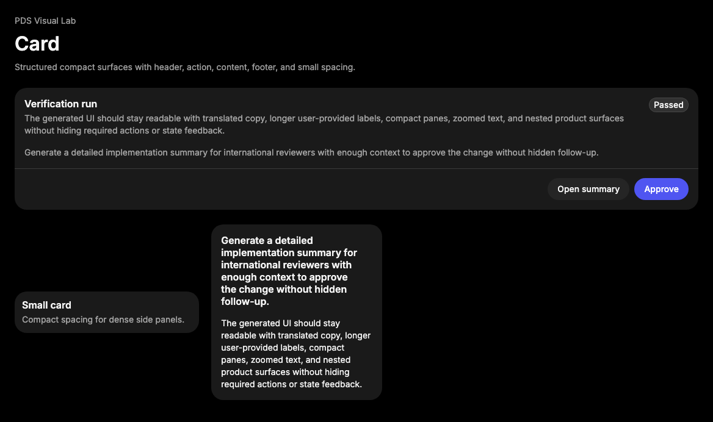

# Card

## Purpose

Card provides a compact structured surface for repeated objects, summaries, and
small product modules.



## When To Use

- Use for repeated resource summaries, settings modules, and compact status
  panels.
- Use when header, optional action, content, and footer need a predictable
  anatomy.

## When Not To Use

- Do not use Card as a full page section wrapper; use Surface or page layout
  structure.
- Do not nest cards inside cards.

## Anatomy / Slots

```tsx
<Card>
  <CardHeader>
    <CardTitle />
    <CardDescription />
    <CardAction />
  </CardHeader>
  <CardContent />
  <CardFooter />
</Card>
```

## Public API

Exports include `Card`, `CardHeader`, `CardTitle`, `CardDescription`,
`CardAction`, `CardContent`, `CardFooter`, and their prop types.

| Prop | Values | Default | Notes |
| --- | --- | --- | --- |
| `size` | `default`, `sm` | `default` | Adjusts card spacing and padding. |

## Data Attributes

| Attribute | Values | Owner |
| --- | --- | --- |
| `data-slot` | `card`, `card-header`, `card-title`, `card-description`, `card-action`, `card-content`, `card-footer` | Component |
| `data-size` | `default`, `sm` | Component |

## Accessibility Contract

Card is structural and does not add landmark, group, or heading semantics by
default. Consumers own heading levels, interactive child labels, and any ARIA
relationships required by the product surface.

## Content Resilience Rules

Card text slots wrap long user-generated labels and translated text. Keep
primary actions concise, put longer context in `CardDescription` or
`CardContent`, and avoid fixed-height card layouts.

## Styling Contract

Classes use the `pds-card-*` prefix. CSS owns the card surface, header grid,
action placement, content padding, footer divider, and `data-size` spacing.

## Token Usage

Uses color, spacing, radius, elevation, typography, and divider tokens.

## State Contract

| State | Trigger | Visual treatment | Data attribute / selector | Accessibility notes |
| --- | --- | --- | --- | --- |
| Default | Normal render | Structured surface with optional header, content, action, and footer slots. | `data-slot='card'` | Semantics are consumer-owned. |
| Size | `size='sm'` | Tighter spacing and padding. | `data-size='sm'` | Does not change content semantics. |

Non-applicable states: Hover, Active, Disabled, Loading, Error, Success. Use
child controls or surrounding regions for those states.

## State Behavior

Card has no managed interaction state. `size` only changes spacing metadata and
CSS.

## Composition Examples

```tsx
import { Card, CardContent, CardHeader, CardTitle } from "@pds/react";

<Card>
  <CardHeader>
    <CardTitle>Run summary</CardTitle>
  </CardHeader>
  <CardContent>Three checks passed.</CardContent>
</Card>
```

## Known Limitations

- Card does not provide selectable, link, or disclosure behavior.
- Card does not enforce heading levels.

## Do / Don't For Agents

Do:

- Use Card for repeated object summaries with a clear title.

Don't:

- Do not wrap whole pages or unrelated sections in Card.

## Related Components

- [Surface](surface.md)
- [ActionWidget](action-widget.md)
- [Cell](cell.md)

## Related Sources

- Component source: [packages/react/src/components/card.tsx](../../../packages/react/src/components/card.tsx)
