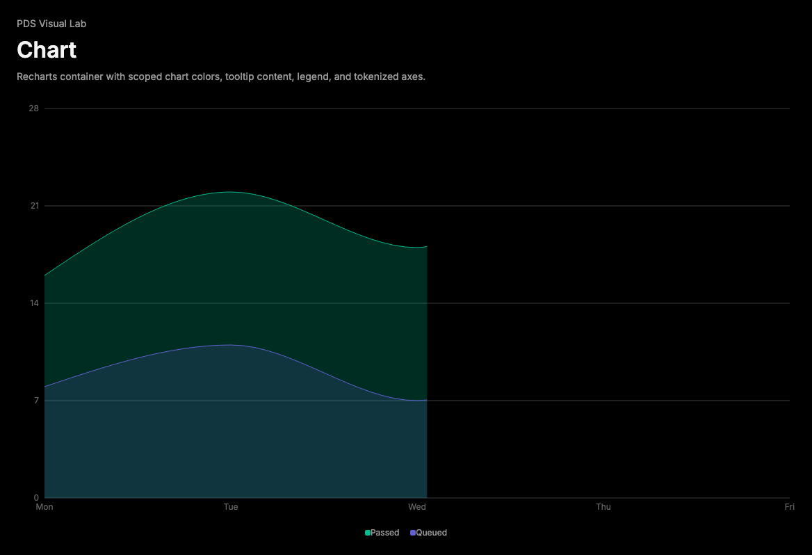

# Chart

## Purpose

Chart provides PDS wrappers for Recharts containers, scoped color variables,
tooltip content, and legend content from `temp-ext-v4`.



## When To Use

- Use for compact product analytics, run status trends, and operational charts.
- Use `ChartContainer` to scope `--color-*` variables from `config`.
- Use `ChartTooltipContent` and `ChartLegendContent` for tokenized overlays.

## When Not To Use

- Do not use for tabular comparison where Table is clearer.
- Do not use for custom canvas/WebGL charts.
- Do not encode meaning only with color.

## Anatomy / Slots

```tsx
<ChartContainer config={config}>
  <AreaChart data={data}>
    <ChartTooltip content={<ChartTooltipContent />} />
    <ChartLegend content={<ChartLegendContent />} />
  </AreaChart>
</ChartContainer>
```

## Public API

Exports include `ChartContainer`, `ChartStyle`, `ChartTooltip`,
`ChartTooltipContent`, `ChartLegend`, `ChartLegendContent`, `useChart`,
`ChartConfig`, and `ChartContainerProps`.

## Data Attributes

| Attribute | Values | Owner |
| --- | --- | --- |
| `data-slot` | `chart` | Component |
| `data-chart` | generated chart id | Component |
| `data-indicator` | `dot`, `line`, `dashed` | Component |
| `data-align` | Recharts legend vertical alignment | Component |

## Accessibility Contract

Recharts owns chart SVG accessibility behavior. Consumers must provide nearby
text summaries or tables for critical values and must not rely on color alone.

## Content Resilience Rules

Tooltip rows wrap long labels and preserve tabular numeric alignment. Keep chart
containers responsive and set a minimum height when embedded in dense panels.

## Styling Contract

Classes use the `pds-chart-*` prefix. CSS owns Recharts descendant axis/grid
treatment, tooltip surface, indicator variants, and legend layout.

## Token Usage

Uses foreground, grey tone, popover, state layer, elevation, spacing, radius,
typography, and tabular font tokens. Data series colors are scoped through
`ChartConfig`.

## State Contract

| State | Trigger | Visual treatment | Selector | Accessibility notes |
| --- | --- | --- | --- | --- |
| Default | Normal render | Responsive chart area. | `.pds-chart` | Pair with text summary. |
| Tooltip active | Recharts hover/focus | Popover surface and item rows. | `.pds-chart-tooltip` | Recharts controls activation. |
| Indicator variants | `indicator` prop | Dot, line, or dashed marker. | `[data-indicator]` | Do not rely only on indicator color. |
| Legend aligned | Recharts `verticalAlign` | Top/bottom padding. | `.pds-chart-legend[data-align]` | Legend text should be meaningful. |

## State Behavior

`ChartContainer` creates a stable chart id, injects scoped CSS variables through
`ChartStyle`, provides config through context, and wraps Recharts
`ResponsiveContainer`.

## Composition Examples

```tsx
import { ChartContainer, ChartTooltip, ChartTooltipContent } from "@pds/react";
import { Line, LineChart } from "recharts";

<ChartContainer config={{ runs: { label: "Runs", color: "var(--pds-color-accent)" } }}>
  <LineChart data={data}>
    <ChartTooltip content={<ChartTooltipContent />} />
    <Line dataKey="runs" stroke="var(--color-runs)" />
  </LineChart>
</ChartContainer>;
```

## Known Limitations

- Chart does not re-export Recharts primitives.
- Chart does not generate textual summaries automatically.

## Do / Don't For Agents

Do:

- Keep chart colors in `ChartConfig`.
- Include labels and summaries for important data.

Don't:

- Do not hard-code Recharts descendant styling in app code.

## Related Sources

- Component source: [packages/react/src/components/chart.tsx](../../../packages/react/src/components/chart.tsx)
