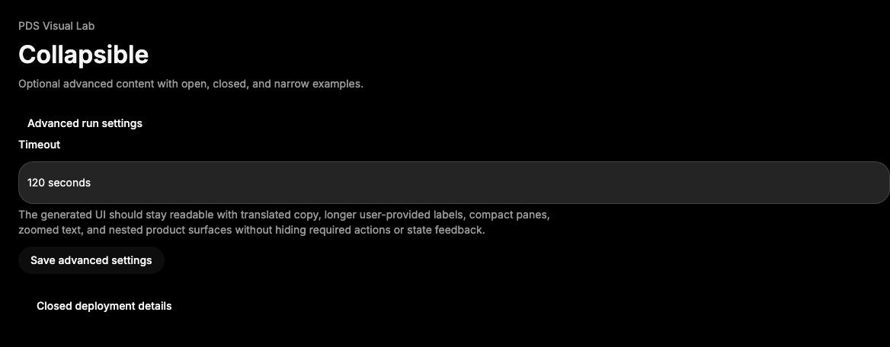

# Collapsible

## Purpose

Collapsible reveals or hides supporting content without navigating away from the
current task.



## When To Use

- Use for optional details, advanced settings, or secondary metadata.
- Use when content should remain in the page structure instead of opening an
  overlay.

## When Not To Use

- Do not use Collapsible for primary required content.
- Do not use it for mutually exclusive accordion sections until an Accordion
  primitive exists.

## Anatomy / Slots

```tsx
<Collapsible>
  <CollapsibleTrigger />
  <CollapsibleContent />
</Collapsible>
```

## Public API

Exports include `Collapsible`, `CollapsibleTrigger`, and
`CollapsibleContent`. Props are inherited from Radix Collapsible primitives.

## Data Attributes

| Attribute | Values | Owner |
| --- | --- | --- |
| `data-slot` | `collapsible-trigger`, `collapsible-content` | Component |
| `data-state` | `open`, `closed` | Radix |
| `data-disabled` | Radix disabled state when used | Radix |

## Accessibility Contract

Radix owns trigger/content association, open state metadata, and keyboard
activation. Consumers own clear trigger labels and must not hide required
workflow information inside a collapsed region.

## Content Resilience Rules

CollapsibleContent clips during transition and then lets inner content define
height. Long content should use normal page wrapping or a nested ScrollArea only
when the product task needs constrained height.

## Styling Contract

Classes use the `pds-collapsible-*` prefix. CSS owns the quiet trigger affordance,
focus ring, hover/active treatment, and content open animation.

## Token Usage

Uses typography, spacing, radius, color, state layer, focus, and motion tokens.

## State Contract

| State | Trigger | Visual treatment | Data attribute / selector | Accessibility notes |
| --- | --- | --- | --- | --- |
| Default | Closed or uncontrolled render | Trigger is quiet; content follows Radix state. | `data-slot='collapsible-*'` | Radix links trigger and content state. |
| Hover | Pointer over trigger | Neutral state-layer background. | `.pds-collapsible-trigger:not(:disabled):hover` | Trigger remains a button. |
| Focus-visible | Keyboard focus on trigger | Shared PDS focus ring. | `.pds-collapsible-trigger:focus-visible` | Focus stays on trigger. |
| Open | `open` / `defaultOpen` / trigger activation | Content animates in. | `.pds-collapsible-content[data-state="open"]` | Expanded state is Radix-owned. |
| Disabled | Disabled trigger/root | Trigger cannot toggle. | Radix disabled state | Consumers should avoid hiding required content behind disabled triggers. |

Non-applicable states: Error, Loading, Success. Use content children for those
states.

## State Behavior

Open state is controlled or uncontrolled through Radix props. PDS only adds slot
classes and tokenized styling.

## Composition Examples

```tsx
import { Collapsible, CollapsibleContent, CollapsibleTrigger } from "@pds/react";

<Collapsible defaultOpen>
  <CollapsibleTrigger>Advanced settings</CollapsibleTrigger>
  <CollapsibleContent>Retry and timeout controls</CollapsibleContent>
</Collapsible>
```

## Known Limitations

- Collapsible does not coordinate multiple sections.

## Do / Don't For Agents

Do:

- Keep trigger labels explicit about the hidden content.

Don't:

- Do not hide validation errors only inside closed content.

## Related Components

- [ScrollArea](scroll-area.md)
- [Surface](surface.md)

## Related Sources

- Component source: [packages/react/src/components/collapsible.tsx](../../../packages/react/src/components/collapsible.tsx)
