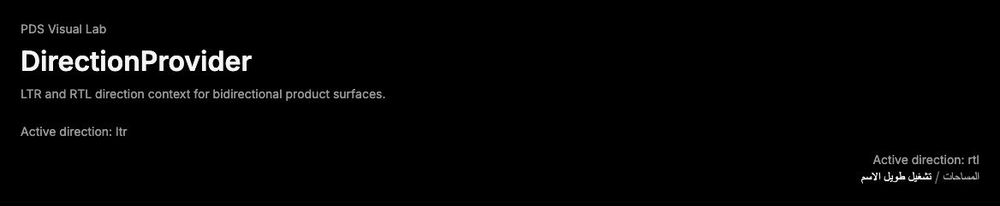

# DirectionProvider

## Purpose

DirectionProvider supplies LTR or RTL context for Radix-backed PDS primitives and
bidirectional product surfaces.



## When To Use

- Use when a PDS surface or subtree needs explicit `ltr` or `rtl` direction.
- Use `direction` as a readable alias for Radix `dir`.

## When Not To Use

- Do not use DirectionProvider as a visual layout wrapper.
- Do not rely on it to set a DOM `dir` attribute for non-Radix children; add
  `dir` to the relevant element when native browser direction is needed.

## Anatomy / Slots

```tsx
<DirectionProvider direction="rtl">
  <Menu />
</DirectionProvider>
```

DirectionProvider is a context provider and does not render a DOM slot.

## Public API

| Prop | Values | Default | Notes |
| --- | --- | --- | --- |
| `dir` | `ltr`, `rtl` | `ltr` | Radix provider prop. |
| `direction` | `ltr`, `rtl` | `dir` | PDS alias used when provided. |

Exports include `DirectionProvider`, `useDirection`, and
`DirectionProviderProps`.

## Data Attributes

DirectionProvider owns no DOM attributes because it renders Radix context only.

## Accessibility Contract

DirectionProvider does not add roles, labels, focus behavior, or announcements.
Consumers must set native `dir` on DOM containers when text direction affects
browser layout, reading order, or bidirectional text rendering.

## Content Resilience Rules

Direction context should be paired with resilient component layouts that wrap
translated text. Do not infer truncation, mirroring, or icon flipping from this
provider alone.

## Styling Contract

DirectionProvider has no component CSS. Styling remains on the consuming
component or DOM container.

## Token Usage

No tokens are used directly.

## State Contract

| State | Trigger | Visual treatment | Data attribute / selector | Accessibility notes |
| --- | --- | --- | --- | --- |
| Direction | `dir` or `direction` | No visual treatment by itself. | Context only | Consumers own DOM `dir` where required. |

Non-applicable states: Hover, focus-visible, active, disabled, loading, error,
and success.

## State Behavior

`direction` overrides `dir` when both are provided. `useDirection` reads the
nearest Radix direction context.

## Composition Examples

```tsx
import { DirectionProvider, useDirection } from "@pds/react";

<DirectionProvider direction="rtl">
  <Toolbar />
</DirectionProvider>;
```

## Known Limitations

- DirectionProvider does not render a DOM node.
- DirectionProvider does not mirror custom icons or set document direction.

## Do / Don't For Agents

Do:

- Add native `dir` where non-Radix text layout needs browser direction.
- Keep direction changes scoped to the smallest subtree.

Don't:

- Do not add component CSS for this provider.
- Do not use it as a substitute for translation-safe layout.

## Related Components

- [Breadcrumbs](breadcrumbs.md)
- [Menu](menu.md)
- [Sheet](sheet.md)

## Related Sources

- Component source: [packages/react/src/components/direction.tsx](../../../packages/react/src/components/direction.tsx)
