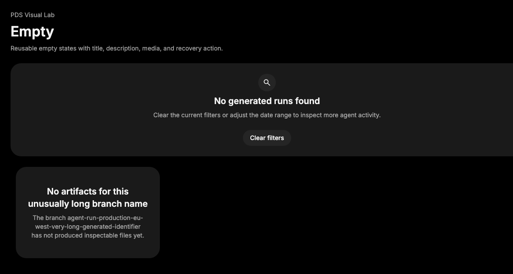

# Empty

## Purpose

Empty provides a reusable empty-state composition for agent-facing surfaces that
need to explain a missing collection, missing result, or unavailable artifact
without becoming a full page layout.



## When To Use

- Use inside panels, tables, lists, or search results when no data is available.
- Use with concise actions that help the user recover or clear the state.

## When Not To Use

- Do not use Empty as a full landing page or marketing hero.
- Do not use Empty for transient failures; use InlineAlert or Toast.

## Anatomy / Slots

```tsx
<Empty>
  <EmptyHeader>
    <EmptyMedia />
    <EmptyTitle />
    <EmptyDescription />
  </EmptyHeader>
  <EmptyContent />
</Empty>
```

## Public API

Exports include `Empty`, `EmptyHeader`, `EmptyMedia`, `EmptyTitle`,
`EmptyDescription`, `EmptyContent`, and their prop types. All slots forward refs
and preserve native props.

| Prop | Values | Default | Notes |
| --- | --- | --- | --- |
| `variant` on `EmptyMedia` | `default`, `icon` | `default` | `icon` provides a tokenized icon surface. |

## Data Attributes

| Attribute | Values | Owner |
| --- | --- | --- |
| `data-slot` | `empty`, `empty-header`, `empty-media`, `empty-title`, `empty-description`, `empty-content` | Component |
| `data-variant` | `default`, `icon` | `EmptyMedia` |

## Accessibility Contract

Empty does not set a landmark or live-region role. Consumers own the surrounding
region label and should keep the title and description readable text, not only
iconography.

## Content Resilience Rules

Title and description wrap by default. Empty content should remain centered but
must not hide long generated names, translated descriptions, or recovery
actions at narrow widths.

## Styling Contract

Classes use the `pds-empty-*` prefix. CSS owns centered layout, media variants,
text wrapping, and responsive padding.

## Token Usage

Uses surface color, typography, spacing, radius, and action background tokens.

## State Contract

| State | Trigger | Visual treatment | Data attribute / selector | Accessibility notes |
| --- | --- | --- | --- | --- |
| Default | Normal render | Centered empty-state surface with title, description, and content slots. | `data-slot='empty'` | Surrounding region owns labels. |
| Icon media | `EmptyMedia variant="icon"` | Tokenized rounded media background for an icon. | `data-variant='icon'` | Icon should be decorative when title/description carry the meaning. |

Non-applicable states: Hover, Focus-visible, Active, Disabled, Loading, Error.
Use child controls or surrounding feedback components for those states.

## State Behavior

Empty has no internal state. Media variant changes presentation only.

## Composition Examples

```tsx
import {
  Button,
  Empty,
  EmptyContent,
  EmptyDescription,
  EmptyHeader,
  EmptyTitle
} from "@pds/react";

<Empty>
  <EmptyHeader>
    <EmptyTitle>No runs found</EmptyTitle>
    <EmptyDescription>Clear filters to inspect generated runs.</EmptyDescription>
  </EmptyHeader>
  <EmptyContent>
    <Button intent="secondary">Clear filters</Button>
  </EmptyContent>
</Empty>
```

## Known Limitations

- Empty does not include illustration assets or loading behavior.

## Do / Don't For Agents

Do:

- Explain the missing state and provide a recovery action when one exists.

Don't:

- Do not hide the only explanation in an icon or decorative image.

## Related Components

- [InlineAlert](inline-alert.md)
- [Skeleton](skeleton.md)
- [Button](button.md)

## Related Sources

- Component source: [packages/react/src/components/empty.tsx](../../../packages/react/src/components/empty.tsx)
