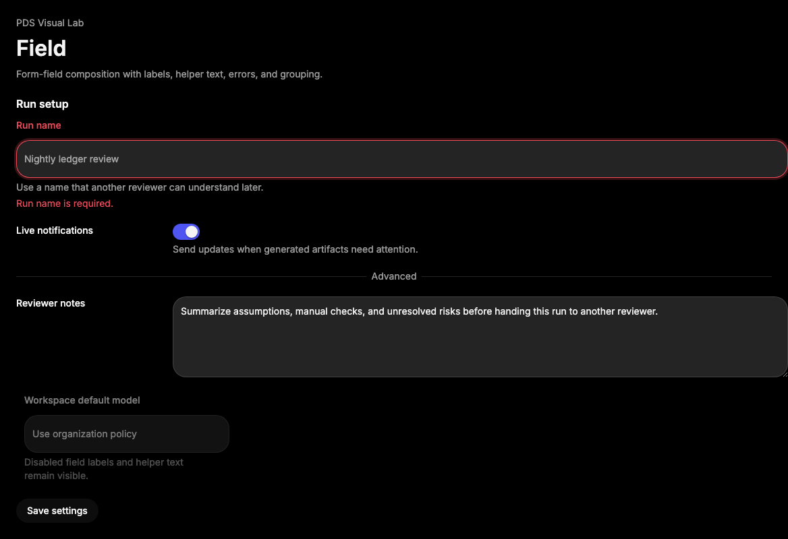

# Field

## Purpose

Field provides the PDS form-field composition for visible labels, helper text,
validation errors, grouped fields, and labeled separators around existing form
controls.



## When To Use

- Use when a control needs label, description, error text, or disabled/invalid
  context.
- Use `FieldSet`, `FieldLegend`, and `FieldGroup` for grouped form regions.
- Use `FieldSeparator` for labeled breaks inside dense field groups.

## When Not To Use

- Do not use Field to replace native control semantics.
- Do not use Field for generic layout rows without form meaning.

## Anatomy / Slots

```tsx
<Field>
  <FieldLabel />
  <FieldContent>
    <Input />
    <FieldDescription />
    <FieldError />
  </FieldContent>
</Field>
```

## Public API

Exports include `Field`, `FieldSet`, `FieldLegend`, `FieldGroup`,
`FieldLabel`, `FieldContent`, `FieldTitle`, `FieldDescription`, `FieldError`,
`FieldSeparator`, and their public types.

| Prop | Values | Default | Notes |
| --- | --- | --- | --- |
| `orientation` on `Field` | `vertical`, `horizontal`, `responsive` | `vertical` | Controls label/content alignment. |
| `invalid` on `Field` | `boolean` | `false` | Adds field-level invalid state and `aria-invalid`. |
| `disabled` on `Field` | `boolean` | `false` | Adds field-level disabled context and `aria-disabled`. |
| `variant` on `FieldLegend` | `legend`, `label` | `legend` | Controls legend type scale. |
| `errors` on `FieldError` | `{ message?: string }[]` | `undefined` | De-duplicates validation messages when children are not provided. |

## Data Attributes

| Attribute | Values | Owner |
| --- | --- | --- |
| `data-slot` | `field`, `field-set`, `field-legend`, `field-group`, `field-label`, `field-content`, `field-title`, `field-description`, `field-error`, `field-error-list`, `field-separator`, `field-separator-content` | Component |
| `data-orientation` | `vertical`, `horizontal`, `responsive` | `Field` |
| `data-invalid` | `true` when invalid | `Field` |
| `data-disabled` | `true` when disabled | `Field` |
| `data-variant` | `legend`, `label` | `FieldLegend` |

## Accessibility Contract

Field renders `role="group"` by default and sets `aria-invalid` or
`aria-disabled` when field state props are true. Consumers must still connect
labels, descriptions, and errors to controls with `htmlFor`, `aria-describedby`,
or native grouping. `FieldError` renders `role="alert"` when content exists.

## Content Resilience Rules

Labels, descriptions, and errors wrap by default and must not be truncated.
Horizontal fields reserve space for labels but content can wrap at narrow
widths. Use `orientation="responsive"` for fields that should become horizontal
only when their group has enough inline space.

## Styling Contract

Classes use the `pds-field-*` prefix. CSS depends on `data-orientation`,
`data-invalid`, `data-disabled`, `data-variant`, and `FieldSeparator` slots.

## Token Usage

Uses typography, spacing, color, radius, disabled opacity, and status danger
tokens. FieldSeparator composes Separator instead of drawing a separate rule.

## State Contract

| State | Trigger | Visual treatment | Data attribute / selector | Accessibility notes |
| --- | --- | --- | --- | --- |
| Default | Normal render | Vertical label/content field stack. | `data-slot='field'`, `data-orientation='vertical'` | Control labels remain consumer-owned. |
| Horizontal | `orientation="horizontal"` | Label/title and content align in a row. | `data-orientation='horizontal'` | Use when label text is short enough to wrap safely. |
| Responsive | `orientation="responsive"` | Vertical by default, horizontal in wider field groups. | `data-orientation='responsive'` | Keeps narrow layouts readable. |
| Disabled | `disabled` | Field context dims supporting text and label. | `data-disabled='true'`, `aria-disabled='true'` | Actual control disabled behavior is still control-owned. |
| Error | `invalid` or `FieldError` content | Label/title and error use danger color. | `data-invalid='true'`, `aria-invalid='true'`, `data-slot='field-error'` | `FieldError` announces as an alert. |

Non-applicable states: Hover, Focus-visible, Active, Loading, Success. Use the
child control or a feedback component for those states.

## State Behavior

- `invalid` sets field-level `data-invalid` and `aria-invalid`.
- `disabled` sets field-level `data-disabled` and `aria-disabled`.
- `FieldError` returns `null` when it has no children and no error messages.
- `FieldError` de-duplicates repeated `errors[].message` values.
- `FieldSeparator` uses the public Separator component for its rule.

## Composition Examples

```tsx
import {
  Field,
  FieldContent,
  FieldDescription,
  FieldError,
  FieldLabel,
  Input
} from "@pds/react";

<Field invalid>
  <FieldLabel htmlFor="run-name">Run name</FieldLabel>
  <FieldContent>
    <Input id="run-name" invalid aria-describedby="run-name-error" />
    <FieldDescription>Use a human-readable name.</FieldDescription>
    <FieldError id="run-name-error">Run name is required.</FieldError>
  </FieldContent>
</Field>
```

## Known Limitations

- Field does not automatically wire `aria-describedby` or `htmlFor`.
- Field does not perform validation.

## Do / Don't For Agents

Do:

- Keep visible labels, helper text, and errors inspectable.
- Pair Field state with the matching child control state when applicable.

Don't:

- Do not hide required labels or error messages in placeholders.

## Related Components

- [Label](label.md)
- [Input](input.md)
- [Textarea](textarea.md)
- [Separator](separator.md)

## Related Sources

- Component source: [packages/react/src/components/field.tsx](../../../packages/react/src/components/field.tsx)
