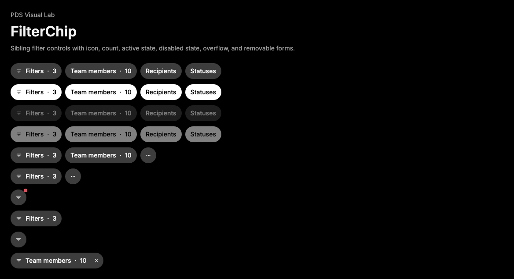

# FilterChip

## Purpose

FilterChip is the compact, single-pill filter control for PDS product surfaces.
Each FilterChip opens, targets, or summarizes one filter dimension. A row of
filters is made from sibling FilterChip instances.



## When To Use

- Use for toolbar, header, or list controls that open filter choices.
- Use one FilterChip per visible pill such as `Filters · 3`,
  `Team members · 10`, `Recipients`, or an overflow affordance.
- Use `active` when that chip is selected or represents applied filter state.
- Use `count` for the visible numeric summary after the chip label.

## When Not To Use

- Do not use FilterChip as a container for other chips.
- Do not put value pills inside FilterChip; render sibling FilterChip instances
  instead.
- Do not use FilterChip for status metadata; use Badge.
- Do not use FilterChip for primary actions; use Button.
- Do not hide applied filter state in color alone when a count can be shown.

## Anatomy / Slots

```tsx
<FilterChip count={3} icon="filter_list" label="Filters" />
<FilterChip count={10} label="Team members" />
<FilterChip label="Recipients" />
<FilterChip aria-label="More filters" icon="more_horiz" iconOnly />
```

FilterChip is one pill. The primary action and optional remove action are
sibling buttons inside the root so remove controls never create nested buttons.

## Public API

| Prop | Values | Default | Notes |
| --- | --- | --- | --- |
| `label` | `ReactNode` | `undefined` | Visible chip label unless `iconOnly` is true. String labels can also name icon-only chips. |
| `icon` | Material Symbols name | `undefined` | Optional leading icon rendered through Icon. |
| `count` | `ReactNode` | `undefined` | Optional visible summary rendered after a separator. |
| `active` | `boolean` | `false` | Maps to `data-active` and default `aria-pressed` when no `aria-pressed` prop is provided. |
| `disabled` | native button disabled | `false` | Disables the primary action and remove action. |
| `iconOnly` | `boolean` | `false` | Renders the compact circular form. Provide `aria-label`, `aria-labelledby`, or a string `label`. |
| `notification` | `boolean` | `false` | Adds a small status-danger notification dot for icon-only filter alerts. |
| `onRemove` | button click handler | `undefined` | Adds a sibling remove button. |
| `removeLabel` | `string` | generated from `label` | Accessible name for the remove button. |

FilterChip extends native `button` attributes for the primary action, forwards a
ref to the root `span`, preserves `className`, and defaults action `type` to
`button`.

## Data Attributes

| Attribute | Values | Owner |
| --- | --- | --- |
| `data-slot` | `filter-chip` | Root |
| `data-slot` | `filter-chip-action` | Primary action |
| `data-slot` | `filter-chip-icon` | Icon |
| `data-slot` | `filter-chip-label` | Label |
| `data-slot` | `filter-chip-separator` | Separator |
| `data-slot` | `filter-chip-count` | Count |
| `data-slot` | `filter-chip-remove` | Remove button |
| `data-slot` | `filter-chip-notification` | Notification dot |
| `data-active` | `true` | Root |
| `data-disabled` | `true` | Root |
| `data-icon-only` | `true` | Root |
| `data-removable` | `true` | Root |

## Accessibility Contract

FilterChip renders native buttons for actions. Consumers should wire
`aria-expanded`, `aria-controls`, or popover/menu behavior when the chip opens
another surface.

When `active` is true, the primary action sets `aria-pressed="true"` unless the
consumer provides `aria-pressed`. Icon-only chips must have an accessible name
through `aria-label`, `aria-labelledby`, or a string `label`.

Remove buttons are sibling controls with their own accessible name and native
disabled behavior.

## Content Resilience Rules

FilterChip labels wrap by default. Keep counts visible next to their labels in
narrow toolbars, translated strings, zoomed layouts, and compact side panels.
Do not truncate required filter state inside this component.

`iconOnly` is the fixed-size exception. It should contain a compact icon such as
`filter_list` or `more_horiz`, not visible prose.

## Styling Contract

The root class is `pds-filter-chip`. Action, icon, label, separator, count,
remove, and notification styling uses the matching `pds-filter-chip-*` classes.
Styling lives in `packages/react/src/components.css`.

CSS depends on `data-active`, `data-disabled`, `data-icon-only`,
`data-removable`, native `:disabled`, `:hover`, `:active`, and
`:focus-visible`. Preserve those selectors when changing implementation
details.

## Token Usage

FilterChip uses PDS color, typography, spacing, radius, focus, status, and
motion tokens. The active reference state uses the neutral accent tokens for a
white selected pill, while hover and pressed treatments use shared state-layer
tokens.

## State Contract

| State | Trigger | Visual treatment | Data attribute / selector | Accessibility notes |
| --- | --- | --- | --- | --- |
| Default | Normal render | Chip renders neutral filter surface with label, optional icon, count, remove, and notification slots. | `data-slot='filter-chip'` | Primary action and remove control are native buttons. |
| Hover | Pointer hover | Enabled chip applies hover state layer; active chip preserves selected fill. | `.pds-filter-chip:not([data-disabled='true']):hover` | Hover is suppressed when root is disabled. |
| Focus-visible | Keyboard focus | Action and remove buttons use shared PDS focus shadow. | `.pds-filter-chip-action:focus-visible`, `.pds-filter-chip-remove:focus-visible` | Focus stays on the button being operated. |
| Active | Pressed | Enabled chip applies pressed state layer; active chip keeps selected treatment. | `.pds-filter-chip:not([data-disabled='true']):active`, `data-active='true'` | `active` maps to pressed semantics for the primary action. |
| Disabled | `disabled` / `aria-disabled` | Disabled chip dims and suppresses hover or pressed layers. | `data-disabled='true'`, child `:disabled` | Native child buttons are disabled and cannot activate. |

Non-applicable states: Loading, Error, Success. Use child components or the surrounding region for those states when needed.

## State Behavior

`active` changes visual treatment and default pressed semantics. Native
`disabled` prevents activation on both action buttons and removes hover/pressed
treatments through root `data-disabled`. FilterChip does not own popover state
or filter values.

## Composition Examples

```tsx
import { FilterChip } from "@pds/react";

<FilterChip count={3} icon="filter_list" label="Filters" />
<FilterChip active count={10} label="Team members" />
<FilterChip disabled label="Recipients" />
<FilterChip aria-label="More filters" icon="more_horiz" iconOnly />
<FilterChip label="Statuses" onRemove={handleRemoveStatus} />
```

## Known Limitations

- FilterChip does not open a popover or menu by itself.
- FilterChip does not manage filter selection state.
- FilterChip does not validate Material Symbols names at runtime.

## Do / Don't For Agents

Do:

- Preserve the single-pill anatomy: one FilterChip equals one visible chip.
- Render repeated filter options as sibling FilterChip instances.
- Preserve native button semantics and default `type="button"`.
- Keep labels and counts visible and wrapping.
- Use `Icon` with Material Symbols names for leading and overflow icons.
- Use `active` only for applied or selected filter state.

Don't:

- Do not add chips, badges, or value pills inside a FilterChip.
- Do not recreate `FilterChip.Value` or any child-slot value API.
- Do not add icon-only filter chips without an accessible label.
- Do not hard-code colors, spacing, radius, or motion values.

## Related Components

- [Button](button.md)
- [Badge](badge.md)
- [Icon](icon.md)
- [Popover](popover.md)

## Related Sources

- Component source: [packages/react/src/components/filter-chip.tsx](../../../packages/react/src/components/filter-chip.tsx)
