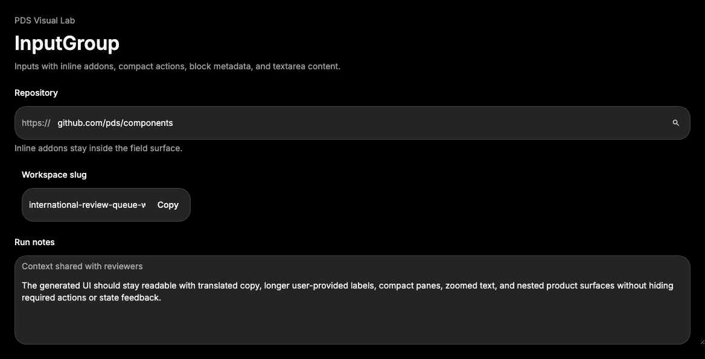

# InputGroup

## Purpose

InputGroup composes an input or textarea with inline or block addons such as
prefixes, suffixes, compact actions, or contextual metadata.



## When To Use

- Use for input prefixes, suffixes, inline units, compact submit buttons, or
  field-level affordances that are visually part of the control.
- Use block addons when metadata belongs inside the same field surface.

## When Not To Use

- Do not use InputGroup to replace Field labels, descriptions, or validation
  messages.
- Do not use it for unrelated controls beside a field; use Field and layout
  primitives.

## Anatomy / Slots

```tsx
<InputGroup>
  <InputGroupAddon />
  <InputGroupInput />
  <InputGroupButton />
</InputGroup>
```

## Public API

Exports include `InputGroup`, `InputGroupAddon`, `InputGroupButton`,
`InputGroupText`, `InputGroupInput`, `InputGroupTextarea`, and their prop types.

| Prop | Values | Default | Notes |
| --- | --- | --- | --- |
| `disabled` on `InputGroup` | boolean | `false` | Dims the group; also disable child controls. |
| `align` on `InputGroupAddon` | `inline-start`, `inline-end`, `block-start`, `block-end` | `inline-start` | Controls addon placement. |
| `size` on `InputGroupButton` | `xs`, `sm`, `icon-xs`, `icon-sm` | `xs` | Compact action size inside the field surface. |
| `intent` on `InputGroupButton` | Button intents | `quiet` | Passed to Button. |

## Data Attributes

| Attribute | Values | Owner |
| --- | --- | --- |
| `data-slot` | `input-group`, `input-group-addon`, `input-group-button`, `input-group-text`, `input-group-control` | Component |
| `data-align` | `inline-start`, `inline-end`, `block-start`, `block-end` | Component |
| `data-input-group-size` | `xs`, `sm`, `icon-xs`, `icon-sm` | Component |
| `data-disabled` | `true` when disabled | Component |

## Accessibility Contract

InputGroup renders `role="group"` by default. Consumers still own visible
Field labels, helper text, errors, and `aria-describedby` wiring. Clicking a
non-interactive addon focuses the first control slot. Interactive addons must
have accessible names and must not hide the input label.

## Content Resilience Rules

Inline addons should be short. Use block addons for longer helper metadata.
InputGroup keeps the control flexible and supports narrow containers by wrapping
text in addon slots while leaving text entry available.

## Styling Contract

Classes use the `pds-input-group-*` prefix. CSS owns the shared field surface,
focus and invalid rings on the group, addon ordering, compact button sizing, and
control shadow resets. Preserve `data-slot="input-group-control"` because focus
and addon-click behavior depend on it.

## Token Usage

Uses field surface color, typography, spacing, radius, focus, invalid, disabled
opacity, and motion tokens.

## State Contract

| State | Trigger | Visual treatment | Data attribute / selector | Accessibility notes |
| --- | --- | --- | --- | --- |
| Default | Normal render | Shared field surface with addons and flexible control. | `data-slot='input-group'` | Group semantics supplement, not replace, Field labeling. |
| Focus-visible | Control receives keyboard focus | Shared PDS focus ring appears on the group. | `:has([data-slot="input-group-control"]:focus-visible)` | Focus remains on the native control. |
| Error | Child control has `aria-invalid` | Group renders invalid ring. | `:has([aria-invalid="true"])` | Pair with visible error text. |
| Disabled | `disabled` on group and children | Group dims; child controls should also be disabled. | `data-disabled`, child disabled states | Disabled child controls prevent editing. |

Non-applicable states: Loading and Success. Use adjacent status text or Button
children for those states.

## State Behavior

`InputGroupInput` and `InputGroupTextarea` reuse Input and Textarea behavior but
override the visible slot to `input-group-control`. `InputGroupButton` reuses
Button behavior with compact sizing metadata.

## Composition Examples

```tsx
import { InputGroup, InputGroupAddon, InputGroupInput, InputGroupText } from "@pds/react";

<InputGroup aria-label="Repository URL">
  <InputGroupAddon>
    <InputGroupText>https://</InputGroupText>
  </InputGroupAddon>
  <InputGroupInput aria-label="Repository URL" />
</InputGroup>
```

## Known Limitations

- InputGroup does not manage form submission side effects.
- InputGroup does not replace external Field labeling.

## Do / Don't For Agents

Do:

- Keep addons short and make interactive addon buttons accessible.

Don't:

- Do not put error text only inside an addon.

## Related Components

- [Input](input.md)
- [Textarea](textarea.md)
- [Field](field.md)
- [Button](button.md)

## Related Sources

- Component source: [packages/react/src/components/input-group.tsx](../../../packages/react/src/components/input-group.tsx)
