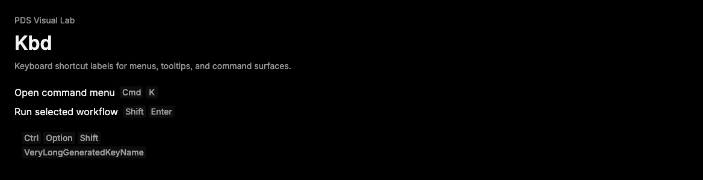

# Kbd

## Purpose

Kbd displays keyboard shortcuts and command chords in PDS product UI with stable
typography, spacing, and grouping behavior.



## When To Use

- Use for keyboard shortcuts in menus, tooltips, command palettes, and help
  surfaces.
- Use `KbdGroup` for multi-key shortcuts such as `Cmd` plus `K`.

## When Not To Use

- Do not use Kbd for clickable controls.
- Do not use Kbd as a badge or status label.

## Anatomy / Slots

```tsx
<KbdGroup aria-label="Open command menu shortcut">
  <Kbd>Cmd</Kbd>
  <Kbd>K</Kbd>
</KbdGroup>
```

## Public API

Exports include `Kbd`, `KbdGroup`, `KbdProps`, and `KbdGroupProps`. Both
components forward refs and preserve native element props.

| Prop | Values | Default | Notes |
| --- | --- | --- | --- |
| `children` | React node | required | Shortcut key text or icon. |
| `aria-label` | string | `undefined` | Recommended on `KbdGroup` when the shortcut meaning is not adjacent. |

## Data Attributes

| Attribute | Values | Owner |
| --- | --- | --- |
| `data-slot` | `kbd`, `kbd-group` | Component |

## Accessibility Contract

Kbd renders a native `kbd` element. It is not interactive. Consumers should keep
the action name available in adjacent text, `aria-label`, or menu item content.

## Content Resilience Rules

Kbd preserves key labels on one line, while `KbdGroup` can wrap as needed.
Prefer short labels such as `Cmd`, `Shift`, or `K`.

## Styling Contract

Classes use the `pds-kbd-*` prefix. Tooltip context may adjust the key surface
while preserving the same slot.

## Token Usage

Uses typography, spacing, radius, color, and surface tokens.

## State Contract

| State | Trigger | Visual treatment | Data attribute / selector | Accessibility notes |
| --- | --- | --- | --- | --- |
| Default | Normal render | Compact neutral key surface. | `data-slot='kbd'` | Native `kbd` semantics identify user input. |
| Grouped | `KbdGroup` composition | Keys wrap in a compact inline group. | `data-slot='kbd-group'` | Add an accessible label when meaning is not nearby. |

Non-applicable states: Hover, Focus-visible, Active, Disabled, Loading, Error.

## State Behavior

Kbd does not manage state or keyboard behavior.

## Composition Examples

```tsx
import { Kbd, KbdGroup } from "@pds/react";

<KbdGroup aria-label="Open command menu shortcut">
  <Kbd>Cmd</Kbd>
  <Kbd>K</Kbd>
</KbdGroup>
```

## Known Limitations

- Kbd does not normalize platform shortcut names.

## Do / Don't For Agents

Do:

- Keep shortcut labels short and inspectable.

Don't:

- Do not attach click handlers to Kbd.

## Related Components

- [Menu](menu.md)
- [Tooltip](tooltip.md)
- [ActionMenu](action-menu.md)

## Related Sources

- Component source: [packages/react/src/components/kbd.tsx](../../../packages/react/src/components/kbd.tsx)
