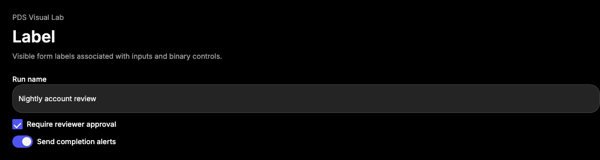

# Label

## Purpose

Label provides the PDS form-label primitive for associating visible text with a
single form control while preserving Radix label behavior, PDS typography, and
stable styling hooks.



## When To Use

- Use for visible labels tied to `Input`, `Textarea`, `Select`, `Checkbox`,
  `RadioGroup`, `Switch`, or custom form controls.
- Use inside `FieldLabel` when the field also needs helper or error text.

## When Not To Use

- Do not use Label as generic emphasis text; use the surrounding component slot.
- Do not rely on placeholder text instead of a visible label.

## Anatomy / Slots

```tsx
<Label htmlFor="run-name">Run name</Label>
```

## Public API

Label exports `Label` and `LabelProps`. It accepts Radix Label root props,
forwards refs, and preserves `className`.

| Prop | Values | Default | Notes |
| --- | --- | --- | --- |
| `htmlFor` | string | `undefined` | Associates the label with a form control. |
| `asChild` | Radix slot boolean | `false` | Uses Radix composition when needed. |

## Data Attributes

| Attribute | Values | Owner |
| --- | --- | --- |
| `data-slot` | `label` | Component |

## Accessibility Contract

Label renders Radix Label root semantics. Consumers must connect labels to
controls with `htmlFor`, nesting, or `aria-labelledby` when native association
is not possible.

## Content Resilience Rules

Labels wrap by default and must remain visible at narrow widths and 200% zoom.
Do not truncate required labels.

## Styling Contract

The root class is `pds-label`. CSS also responds to disabled parent context from
Field and disabled descendants.

## Token Usage

Uses typography, spacing, color, and disabled opacity tokens.

## State Contract

| State | Trigger | Visual treatment | Data attribute / selector | Accessibility notes |
| --- | --- | --- | --- | --- |
| Default | Normal render | Inline-flex label with PDS emphasis typography. | `data-slot='label'` | Native label association is consumer-owned. |
| Disabled | Disabled parent field, disabled fieldset, or disabled descendant | Label dims with disabled opacity. | `.pds-field[data-disabled='true'] .pds-label`, `.pds-field-set:disabled .pds-label`, `.pds-label:has(:disabled)` | Disabled control behavior remains owned by the control or fieldset. |

Non-applicable states: Hover, Focus-visible, Active, Loading, Error. Use Field
or the associated control for those states.

## State Behavior

Label does not manage state. It reflects disabled context through CSS selectors.

## Composition Examples

```tsx
import { Input, Label } from "@pds/react";

<Label htmlFor="run-name">Run name</Label>
<Input id="run-name" />
```

## Known Limitations

- Label does not render helper text or errors; use Field for full field anatomy.

## Do / Don't For Agents

Do:

- Keep labels visible and associated with their controls.

Don't:

- Do not use placeholder text as the only label.

## Related Components

- [Field](field.md)
- [Input](input.md)
- [Textarea](textarea.md)

## Related Sources

- Component source: [packages/react/src/components/label.tsx](../../../packages/react/src/components/label.tsx)
