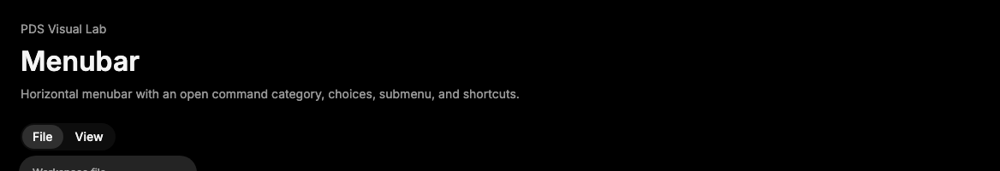

# Menubar

## Purpose

Menubar provides a compact horizontal command menu system backed by Radix
Menubar and styled for dense product controls.



## When To Use

- Use for persistent command categories such as File, Edit, View, and Run.
- Use when an imported surface expects `Menubar*` exports from PDS.

## When Not To Use

- Do not use Menubar for primary app navigation; use page or navigation
  patterns instead.
- Do not use Menubar for a single action trigger; use Button or DropdownMenu.

## Anatomy / Slots

```tsx
<Menubar>
  <MenubarMenu value="file">
    <MenubarTrigger />
    <MenubarContent>
      <MenubarItem />
    </MenubarContent>
  </MenubarMenu>
</Menubar>
```

## Public API

Exports include `Menubar`, `MenubarMenu`, `MenubarTrigger`, `MenubarContent`,
`MenubarItem`, `MenubarCheckboxItem`, `MenubarRadioGroup`,
`MenubarRadioItem`, `MenubarLabel`, `MenubarSeparator`, `MenubarShortcut`,
`MenubarGroup`, `MenubarPortal`, `MenubarSub`, `MenubarSubTrigger`, and
`MenubarSubContent`.

`MenubarItem`, `MenubarCheckboxItem`, and `MenubarRadioItem` accept
`intent="default" | "danger"` and `inset`.

## Data Attributes

| Attribute | Values | Owner |
| --- | --- | --- |
| `data-slot` | `menubar`, `menubar-trigger`, `menubar-content`, `menubar-item`, `menubar-checkbox-item`, `menubar-radio-item`, `menubar-label`, `menubar-separator`, `menubar-shortcut`, `menubar-sub-trigger`, `menubar-sub-content` | Component |
| `data-intent` | `default`, `danger` | Component |
| `data-inset` | `true` | Component |
| `data-highlighted`, `data-disabled`, `data-state` | Radix values | Radix |

## Accessibility Contract

Radix owns menubar roles, menu roles, roving focus, keyboard navigation,
checked state semantics, submenu behavior, and dismissal. Consumers must provide
clear category labels and concise command labels.

## Content Resilience Rules

Menubar triggers and menu items wrap long labels instead of clipping text. Keep
top-level categories short, and move verbose labels into menu items where there
is more width.

## Styling Contract

Classes use the `pds-menubar-*` prefix. CSS owns the menubar rail, trigger
treatment, menu content, item treatment, indicators, separators, shortcuts, and
submenu chevrons.

## Token Usage

Uses action background, popover surface color, typography, spacing, radius,
elevation, state layer, disabled opacity, focus, and motion tokens.

## State Contract

| State | Trigger | Visual treatment | Data attribute / selector | Accessibility notes |
| --- | --- | --- | --- | --- |
| Default | Normal render | Root renders as an inline command rail; content and items use menu treatment. | `data-slot='menubar-*'`, `.pds-menubar` | Radix owns menubar and menu roles. |
| Hover | Pointer hover or Radix highlight | Triggers and highlighted items receive the shared hover state layer. | `data-highlighted`, `.pds-menubar-trigger[data-highlighted]`, `.pds-menubar-item[data-highlighted]` | Highlight follows Radix pointer and keyboard focus management. |
| Focus-visible | Keyboard focus | Focused trigger or item uses the shared PDS focus shadow. | `.pds-menubar-trigger:focus-visible`, `.pds-menubar-item:focus-visible` | Keyboard users navigate categories and menus through Radix behavior. |
| Open | Trigger menu open | Open trigger keeps the hover state layer. | `data-state='open'`, `.pds-menubar-trigger[data-state='open']` | Radix owns open state and active menu value. |
| Checked | Checkbox or radio item selected | Checked items use selected state layer and an indicator. | `data-state='checked'`, `.pds-menubar-item[data-state='checked']` | Radix owns checkbox and radio item ARIA state. |
| Disabled | Disabled trigger or Radix disabled item | Disabled controls use disabled opacity and suppress activation. | `data-disabled`, `.pds-menubar-item[data-disabled]`, `.pds-menubar-trigger[data-disabled]` | Radix removes disabled items from activation. |

Non-applicable states: Loading, Error, Success. Use child content or the
surrounding region for those states.

## State Behavior

Menubar controls the active menu through Radix value state. Highlighted items
use hover state layer. Checked items use selected state layer. Danger items
change foreground only.

## Composition Examples

```tsx
import {
  Menubar,
  MenubarContent,
  MenubarItem,
  MenubarMenu,
  MenubarTrigger
} from "@pds/react";

<Menubar>
  <MenubarMenu value="file">
    <MenubarTrigger>File</MenubarTrigger>
    <MenubarContent>
      <MenubarItem>New run</MenubarItem>
      <MenubarItem intent="danger">Close workspace</MenubarItem>
    </MenubarContent>
  </MenubarMenu>
</Menubar>;
```

## Known Limitations

- Menubar does not include responsive overflow management for many top-level
  categories.

## Do / Don't For Agents

Do:

- Keep top-level trigger labels short.
- Use `MenubarShortcut` for command hints.

Don't:

- Do not use Menubar as a replacement for page navigation.

## Related Components

- [DropdownMenu](dropdown-menu.md)
- [Menu](menu.md)
- [ButtonGroup](button-group.md)

## Related Sources

- Component source: [packages/react/src/components/menubar.tsx](../../../packages/react/src/components/menubar.tsx)
