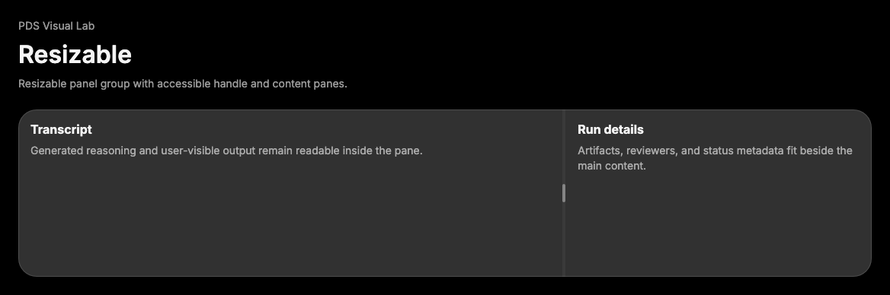

# Resizable

## Purpose

Resizable provides adjustable panel groups for agent workspaces, inspectors,
transcripts, and side-by-side product panes.



## When To Use

- Use when users need to allocate space between two or more persistent panes.
- Use `ResizableHandle` between panels for keyboard and pointer resizing.
- Use panel `minSize` values to keep required content reachable.

## When Not To Use

- Do not use Resizable for card grids, simple columns, or one-off visual splits.
- Do not place handles where resizing would hide required actions or feedback.

## Anatomy / Slots

```tsx
<ResizablePanelGroup>
  <ResizablePanel />
  <ResizableHandle />
  <ResizablePanel />
</ResizablePanelGroup>
```

## Public API

| Prop | Values | Default | Notes |
| --- | --- | --- | --- |
| `orientation` | `horizontal`, `vertical` | `horizontal` | Passed to the primitive and mirrored as data. |
| `withHandle` | boolean | `false` | Adds the visible handle grip. |

Panel group, panel, and handle props pass through to
`react-resizable-panels`. Exports include `ResizablePanelGroup`,
`ResizablePanel`, `ResizableHandle`, and matching prop types.

## Data Attributes

| Attribute | Values | Owner |
| --- | --- | --- |
| `data-slot` | `resizable-panel-group` | `ResizablePanelGroup` |
| `data-orientation` | `horizontal`, `vertical` | `ResizablePanelGroup` |
| `data-slot` | `resizable-panel` | `ResizablePanel` |
| `data-slot` | `resizable-handle` | `ResizableHandle` |
| `data-slot` | `resizable-handle-grip` | Optional handle grip |

The underlying primitive owns resize metadata and ARIA separator attributes.

## Accessibility Contract

`react-resizable-panels` owns separator semantics, keyboard resizing, panel
layout, and pointer resizing. Consumers must keep panels labelled by their
visible surrounding content and choose minimum sizes that preserve task access.

## Content Resilience Rules

Panels should allow content to scroll or wrap instead of clipping required
labels, actions, errors, or state feedback. Handles retain stable hit targets at
narrow widths and 200% zoom.

## Styling Contract

Classes use the `pds-resizable-*` prefix and live in
`packages/react/src/components.css`. CSS depends on `data-orientation`,
`aria-orientation`, focus-visible, hover, active resize, and disabled selectors.

## Token Usage

Resizable uses PDS surface color, border tone, spacing, radius, focus,
interaction state layer, typography inheritance, and motion tokens.

## State Contract

| State | Trigger | Visual treatment | Data attribute / selector | Accessibility notes |
| --- | --- | --- | --- | --- |
| Default | Normal render | Panels sit in a tokenized group with a separator handle. | `data-slot='resizable-*'` | Primitive owns panel layout semantics. |
| Hover | Pointer hover on handle | Handle uses hover state layer. | `.pds-resizable-handle:hover` | Hover does not resize by itself. |
| Focus-visible | Keyboard focus on handle | Handle uses shared focus shadow. | `.pds-resizable-handle:focus-visible` | Keyboard users can resize through the primitive. |
| Active | Resize interaction | Active handle keeps interactive state treatment. | `.pds-resizable-handle[data-resize-handle-active]` | Primitive owns live resize behavior. |
| Disabled | Disabled handle or group | Disabled handle dims and does not resize. | Primitive disabled state | Native/primitive disabled semantics apply. |

Non-applicable states: Loading, error, and success.

## State Behavior

Panel sizes, persistence hooks, keyboard controls, and drag behavior are owned by
`react-resizable-panels`. PDS only adds stable slots and token styling.

## Composition Examples

```tsx
import {
  ResizableHandle,
  ResizablePanel,
  ResizablePanelGroup
} from "@pds/react";

<ResizablePanelGroup>
  <ResizablePanel minSize="30%">Transcript</ResizablePanel>
  <ResizableHandle withHandle />
  <ResizablePanel minSize="20%">Details</ResizablePanel>
</ResizablePanelGroup>;
```

## Known Limitations

- Resizable does not persist layout by default.
- Resizable does not virtualize overflowing panel content.

## Do / Don't For Agents

Do:

- Use `minSize` to protect required content.
- Preserve direct child structure: panel, handle, panel.

Don't:

- Do not put the handle inside a panel.
- Do not use resizable panes for decorative card layout.

## Related Components

- [Sheet](sheet.md)
- [ScrollArea](scroll-area.md)
- [Separator](separator.md)

## Related Sources

- Component source: [packages/react/src/components/resizable.tsx](../../../packages/react/src/components/resizable.tsx)
