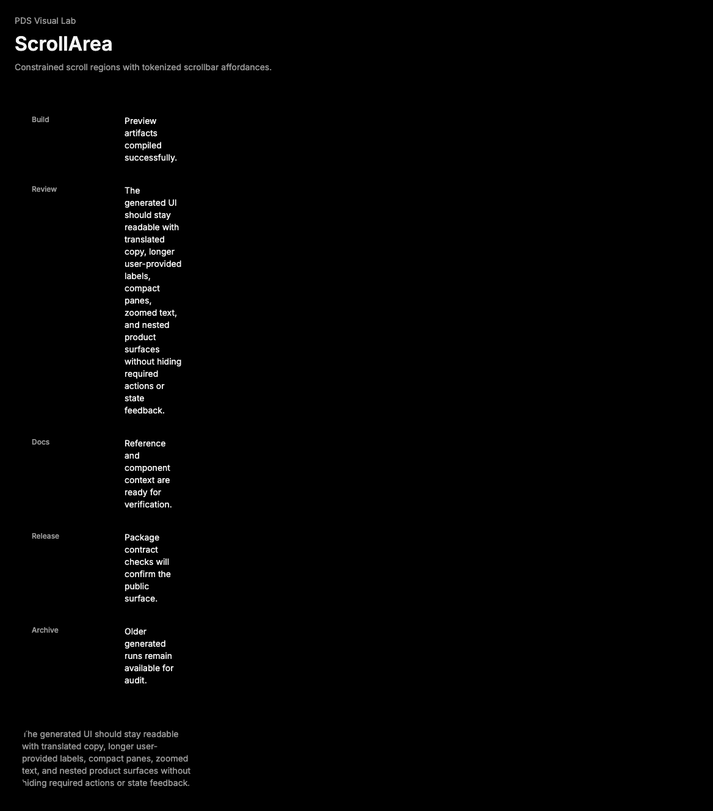

# ScrollArea

## Purpose

ScrollArea provides a tokenized Radix scroll container for constrained content
regions that need visible scroll affordances.



## When To Use

- Use inside panels, popovers, or dense regions where content must stay within a
  bounded area.
- Use when native page scroll is not the right interaction for the content.

## When Not To Use

- Do not use ScrollArea to constrain normal page content by default.
- Do not hide primary actions below an unnecessary nested scroll region.

## Anatomy / Slots

```tsx
<ScrollArea>
  Content
</ScrollArea>
```

`ScrollArea` renders a viewport, scrollbar, thumb, and corner internally.
`ScrollBar` is exported for custom composition.

## Public API

Exports include `ScrollArea`, `ScrollBar`, and `ScrollAreaProps`.

| Prop | Values | Default | Notes |
| --- | --- | --- | --- |
| `viewportProps` | Radix viewport props | `undefined` | Adds attributes or classes to the viewport. |
| `orientation` on `ScrollBar` | `vertical`, `horizontal` | `vertical` | Controls scrollbar axis. |

## Data Attributes

| Attribute | Values | Owner |
| --- | --- | --- |
| `data-slot` | `scroll-area`, `scroll-area-viewport`, `scroll-area-scrollbar`, `scroll-area-thumb`, `scroll-area-corner` | Component |
| `data-orientation` | `vertical`, `horizontal` | Radix |

## Accessibility Contract

Consumers own accessible names when the scroll region needs one. Keyboard focus
can move to focusable content inside the viewport; add `tabIndex` through
`viewportProps` only when the viewport itself needs keyboard focus.

## Content Resilience Rules

Give ScrollArea a bounded height or max-height from the surrounding layout.
Content inside should continue to wrap normally and remain available at 200%
zoom without trapping the rest of the page.

## Styling Contract

Classes use the `pds-scroll-area-*` prefix. CSS owns hidden overflow on the root,
viewport sizing, scrollbar dimensions, thumb hit target, and focus ring on the
viewport.

## Token Usage

Uses spacing, radius, color, focus, and state tokens.

## State Contract

| State | Trigger | Visual treatment | Data attribute / selector | Accessibility notes |
| --- | --- | --- | --- | --- |
| Default | Normal render | Root clips overflow; viewport carries scrollable content. | `data-slot='scroll-area'` | Region labeling is consumer-owned. |
| Focus-visible | Viewport receives keyboard focus | Shared PDS focus ring. | `.pds-scroll-area-viewport:focus-visible` | Use only when viewport is intentionally focusable. |
| Orientation | Scrollbar axis | Scrollbar dimensions follow Radix orientation. | `.pds-scroll-area-scrollbar[data-orientation]` | Axis must match scroll behavior. |

Non-applicable states: Disabled, Error, Loading, Success. Use surrounding
regions or children for those states.

## State Behavior

Radix owns scrollbar geometry, thumb behavior, and corner rendering. PDS adds
the default vertical scrollbar and exports `ScrollBar` for explicit additions.

## Composition Examples

```tsx
import { ScrollArea } from "@pds/react";

<ScrollArea viewportProps={{ "aria-label": "Recent runs" }}>
  <ol>{runs.map((run) => <li key={run.id}>{run.name}</li>)}</ol>
</ScrollArea>
```

## Known Limitations

- ScrollArea does not virtualize long lists.
- Consumers must provide layout constraints such as height or max-height.

## Do / Don't For Agents

Do:

- Use ScrollArea only when the content region is intentionally bounded.

Don't:

- Do not create nested scroll regions around ordinary page sections.

## Related Components

- [Collapsible](collapsible.md)
- [Popover](popover.md)
- [DataList](data-list.md)

## Related Sources

- Component source: [packages/react/src/components/scroll-area.tsx](../../../packages/react/src/components/scroll-area.tsx)
