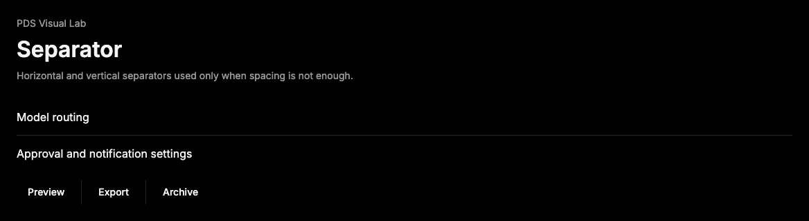

# Separator

## Purpose

Separator provides the explicit PDS divider primitive for the few cases where
spacing, surface contrast, and grouping are not enough to communicate a
relationship.



## When To Use

- Use between unrelated regions inside dense menus, forms, or metadata groups.
- Use vertical separators only for compact inline groups where spacing alone is
  ambiguous.

## When Not To Use

- Do not use Separator as the default way to separate list rows or cards.
- Do not use Separator for decoration when surface contrast or spacing can carry
  the hierarchy.

## Anatomy / Slots

```tsx
<Separator />
<Separator decorative={false} orientation="vertical" />
```

## Public API

Separator exports `Separator` and `SeparatorProps`. It accepts Radix Separator
root props, forwards refs, and preserves `className`.

| Prop | Values | Default | Notes |
| --- | --- | --- | --- |
| `orientation` | `horizontal`, `vertical` | `horizontal` | Controls the rule direction. |
| `decorative` | `boolean` | `true` | Decorative separators are hidden from accessibility APIs. |

## Data Attributes

| Attribute | Values | Owner |
| --- | --- | --- |
| `data-slot` | `separator` | Component |
| `data-orientation` | `horizontal`, `vertical` | Component / Radix |

## Accessibility Contract

Decorative separators are hidden from assistive technology by default. Set
`decorative={false}` when the separator communicates structure that needs to be
announced.

## Content Resilience Rules

Separator has no text content. It stretches in the chosen orientation and should
not force adjacent labels or actions to truncate.

## Styling Contract

The root class is `pds-separator`. CSS uses `data-orientation` for horizontal
and vertical sizing.

## Token Usage

Uses color and radius tokens. Separator exists as an exception to the PDS
preference for spatial separation over physical dividers.

## State Contract

| State | Trigger | Visual treatment | Data attribute / selector | Accessibility notes |
| --- | --- | --- | --- | --- |
| Horizontal | `orientation="horizontal"` | Full-width hairline rule. | `data-orientation='horizontal'` | Decorative unless `decorative={false}`. |
| Vertical | `orientation="vertical"` | Stretching vertical rule. | `data-orientation='vertical'` | Decorative unless `decorative={false}`. |

Non-applicable states: Hover, Focus-visible, Active, Disabled, Loading, Error.

## State Behavior

Orientation changes layout only. Accessibility exposure is controlled by Radix
Separator through `decorative`.

## Composition Examples

```tsx
import { Separator } from "@pds/react";

<Separator />
```

## Known Limitations

- Separator does not include labels; use FieldSeparator for labeled form
  separation.

## Do / Don't For Agents

Do:

- Prefer spacing and surface hierarchy before adding a separator.

Don't:

- Do not use separators as routine list row borders.

## Related Components

- [Field](field.md)
- [Surface](surface.md)
- [Menu](menu.md)

## Related Sources

- Component source: [packages/react/src/components/separator.tsx](../../../packages/react/src/components/separator.tsx)
