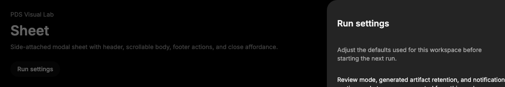

# Sheet

## Purpose

Sheet provides an edge-attached modal panel for settings, details, filters, and
short workflows that should stay connected to the current screen.



## When To Use

- Use for side panels, filters, run settings, or contextual task details.
- Use `side` when the placement carries meaning for the workflow.
- Use `SheetBody` for content that may grow or scroll.

## When Not To Use

- Do not use Sheet for alert confirmations; use AlertDialog.
- Do not use it for bottom-only mobile task panels; use BottomSheet or Drawer.
- Do not hide every close path.

## Anatomy / Slots

```tsx
<Sheet>
  <SheetTrigger />
  <SheetContent side="right">
    <SheetHeader>
      <SheetTitle />
      <SheetDescription />
    </SheetHeader>
    <SheetBody />
    <SheetFooter />
  </SheetContent>
</Sheet>
```

`SheetContent` renders `SheetPortal`, `SheetOverlay`, Radix content, and the
default close button when `showCloseButton` is true.

## Public API

Exports include `Sheet`, `SheetTrigger`, `SheetPortal`, `SheetOverlay`,
`SheetContent`, `SheetClose`, `SheetHeader`, `SheetBody`, `SheetFooter`,
`SheetTitle`, and `SheetDescription`.

| Prop | Values | Default | Notes |
| --- | --- | --- | --- |
| `side` | `top`, `right`, `bottom`, `left` | `right` | Controls edge placement. |
| `showCloseButton` | `boolean` | `true` | Adds the default close button inside `SheetContent`. |

Radix props pass through to their matching primitive exports.

## Data Attributes

| Attribute | Values | Owner |
| --- | --- | --- |
| `data-slot` | `sheet-trigger`, `sheet-overlay`, `sheet-content`, `sheet-close`, `sheet-header`, `sheet-body`, `sheet-footer`, `sheet-title`, `sheet-description` | Component |
| `data-side` | `top`, `right`, `bottom`, `left` | `SheetContent` |
| `data-state` | Radix open and closed values | Radix |

## Accessibility Contract

Radix owns modal dialog role, focus trapping, Escape dismissal, outside
interaction behavior, and title/description wiring. Consumers must provide a
meaningful title and another visible close path when `showCloseButton={false}`.

## Content Resilience Rules

Sheet content is viewport constrained. `SheetBody` scrolls while header and
footer remain reachable. Text wraps under translation, narrow layouts, and 200%
zoom.

## Styling Contract

Classes use the `pds-sheet-*` prefix and live in
`packages/react/src/components.css`. CSS depends on `data-side`, slot classes,
Radix state, close hover/active/focus selectors, and compact viewport media
queries.

## Token Usage

Uses overlay, popover surface, typography, spacing, radius, elevation, focus,
state layer, disabled opacity, and motion tokens.

## State Contract

| State | Trigger | Visual treatment | Data attribute / selector | Accessibility notes |
| --- | --- | --- | --- | --- |
| Default | Normal render | Edge-attached content renders from the configured side. | `data-slot='sheet-*'`, `data-side` | Radix owns modal dialog semantics. |
| Hover | Pointer hover | Default close button uses neutral hover treatment. | `.pds-sheet-close:not(:disabled):hover` | Hover does not change modal semantics. |
| Focus-visible | Keyboard focus | Close button uses shared PDS focus shadow. | `.pds-sheet-close:focus-visible` | Radix moves focus into and out of the sheet. |
| Active | Pressed close | Close button uses pressed state layer before dismissal. | `.pds-sheet-close:not(:disabled):active` | Activation closes through Radix close behavior. |
| Disabled | Disabled close or trigger | Disabled controls use disabled opacity. | `.pds-sheet-close:disabled` | Disabled native controls are not activatable. |

Non-applicable states: Loading, Error, Success. Use child content or the
surrounding workflow for those states.

## State Behavior

Open and closed state is owned by Radix. `side` controls placement only; it does
not change dialog semantics.

## Composition Examples

```tsx
import {
  Sheet,
  SheetBody,
  SheetContent,
  SheetDescription,
  SheetHeader,
  SheetTitle,
  SheetTrigger
} from "@pds/react";

<Sheet>
  <SheetTrigger>Open settings</SheetTrigger>
  <SheetContent side="right">
    <SheetHeader>
      <SheetTitle>Run settings</SheetTitle>
      <SheetDescription>Adjust workspace defaults.</SheetDescription>
    </SheetHeader>
    <SheetBody>Settings content</SheetBody>
  </SheetContent>
</Sheet>;
```

## Known Limitations

- Sheet does not include drag-to-dismiss. Use Drawer when dragging is required.
- Sheet does not include route or form submission behavior.

## Do / Don't For Agents

Do:

- Use `SheetBody` for growing content.
- Preserve the title and description accessibility contract.

Don't:

- Do not turn Sheet into a persistent navigation sidebar.
- Do not hide every close affordance.

## Related Components

- [Dialog](dialog.md)
- [BottomSheet](bottom-sheet.md)
- [Drawer](drawer.md)

## Related Sources

- Component source: [packages/react/src/components/sheet.tsx](../../../packages/react/src/components/sheet.tsx)
