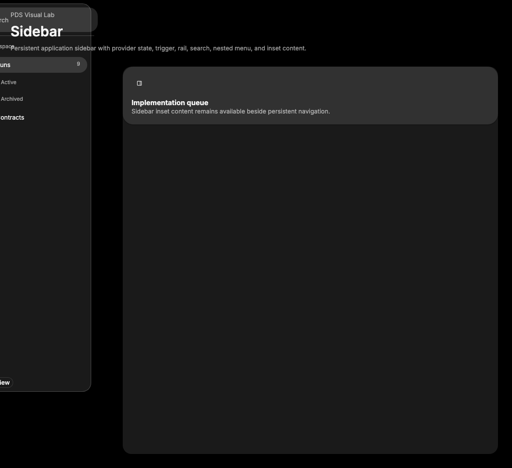

# Sidebar

## Purpose

Sidebar provides a persistent application navigation shell with provider state,
desktop collapse behavior, mobile sheet behavior, menu primitives, nested menu
items, rails, trigger, input, and skeleton helpers from `temp-ext-v4`.



## When To Use

- Use for product navigation that persists beside workspace content.
- Use `SidebarProvider` once around `Sidebar` and `SidebarInset`.
- Use menu subcomponents for grouped navigation, nested links, badges, actions,
  and loading rows.

## When Not To Use

- Do not use for temporary contextual panels; use Sheet or Drawer.
- Do not use for simple page-level tabs; use Tabs.
- Do not place unrelated app state in the sidebar provider.

## Anatomy / Slots

```tsx
<SidebarProvider>
  <Sidebar>
    <SidebarHeader />
    <SidebarContent>
      <SidebarGroup>
        <SidebarMenu>
          <SidebarMenuItem>
            <SidebarMenuButton />
          </SidebarMenuItem>
        </SidebarMenu>
      </SidebarGroup>
    </SidebarContent>
  </Sidebar>
  <SidebarInset />
</SidebarProvider>
```

## Public API

Exports include `Sidebar`, `SidebarProvider`, `SidebarTrigger`, `SidebarRail`,
`SidebarInset`, `SidebarInput`, `SidebarHeader`, `SidebarFooter`,
`SidebarSeparator`, `SidebarContent`, `SidebarGroup`,
`SidebarGroupLabel`, `SidebarGroupAction`, `SidebarGroupContent`,
`SidebarMenu`, `SidebarMenuItem`, `SidebarMenuButton`, `SidebarMenuAction`,
`SidebarMenuBadge`, `SidebarMenuSkeleton`, `SidebarMenuSub`,
`SidebarMenuSubItem`, `SidebarMenuSubButton`, `useSidebar`, and prop types for
exported parts.

## Data Attributes

| Attribute | Values | Owner |
| --- | --- | --- |
| `data-slot` | `sidebar-wrapper`, `sidebar`, `sidebar-gap`, `sidebar-container`, `sidebar-inner`, `sidebar-trigger`, `sidebar-rail`, `sidebar-inset`, and `sidebar-*` menu slots | Component |
| `data-state` | `expanded`, `collapsed` | Component |
| `data-collapsible` | `offcanvas`, `icon`, empty | Component |
| `data-side` | `left`, `right` | Component |
| `data-variant` | `sidebar`, `floating`, `inset` | Component |
| `data-active`, `data-size` | menu button state | Component |

## Accessibility Contract

`SidebarTrigger` and `SidebarRail` toggle the provider state. Mobile sidebars use
Sheet semantics. Menu buttons are native buttons by default and support `asChild`
for links. Tooltip labels are provided for collapsed icon mode through the
internal tooltip provider.

## Content Resilience Rules

Menu labels truncate only inside the final text span to protect icons, actions,
and badges. Do not place wide fixed content in the rail or collapsed icon mode.

## Styling Contract

Classes use the `pds-sidebar-*` prefix. CSS owns desktop shell placement,
offcanvas/icon collapse, inset/floating variants, mobile sheet sizing, menu
row states, nested menu borders, skeleton width, and rail affordance.

## Token Usage

Uses grouped/widget/popover backgrounds, foreground, grey tone borders, state
layers, disabled opacity, spacing, radius, focus, elevation, typography, and
motion tokens.

## State Contract

| State | Trigger | Visual treatment | Selector | Accessibility notes |
| --- | --- | --- | --- | --- |
| Expanded | Provider `open=true` | Full sidebar width. | `[data-state="expanded"]` | Content is visible. |
| Collapsed icon | `collapsible="icon"` and closed | Icon width, labels visually hidden. | `[data-collapsible="icon"]` | Tooltips expose labels. |
| Offcanvas | `collapsible="offcanvas"` and closed | Container translated away. | `[data-collapsible="offcanvas"]` | Trigger restores visibility. |
| Mobile | media query hook | Renders through Sheet. | `[data-mobile="true"]` | Sheet owns dialog semantics. |
| Active item | `isActive` | Hover/selected state layer. | `[data-active="true"]` | Use for current route. |
| Focus-visible | Keyboard focus | Shared PDS focus shadow. | `:focus-visible` | Keep native focus targets. |

## State Behavior

`SidebarProvider` stores desktop open state, mobile open state, exposes
`toggleSidebar`, writes a short-lived cookie, and supports Cmd/Ctrl+B toggling.

## Composition Examples

```tsx
import { Sidebar, SidebarMenuButton, SidebarProvider } from "@pds/react";

<SidebarProvider>
  <Sidebar>
    <SidebarMenuButton asChild>
      <a href="/runs">Runs</a>
    </SidebarMenuButton>
  </Sidebar>
</SidebarProvider>;
```

## Known Limitations

- Sidebar does not manage application routing.
- Sidebar does not virtualize very long navigation trees.

## Do / Don't For Agents

Do:

- Keep collapsed mode usable with `tooltip` labels.
- Use `SidebarInset` for primary content beside the sidebar.

Don't:

- Do not use Sidebar as a generic modal or inspector surface.

## Related Sources

- Component source: [packages/react/src/components/sidebar.tsx](../../../packages/react/src/components/sidebar.tsx)
