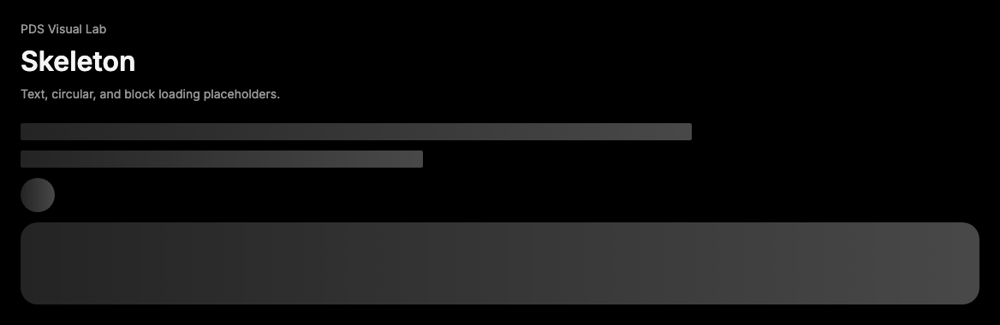

# Skeleton

## Purpose

Skeleton provides loading placeholders for progressive rendering states.



## When To Use

- Use while predictable content is loading.
- Use `shape="text"`, `block`, or `circle` to match expected content.

## When Not To Use

- Do not use as decoration.
- Do not hide actionable errors behind permanent skeletons.

## Anatomy / Slots

```tsx
<Skeleton shape="text" />
```

## Public API

| Prop | Values | Default | Notes |
| --- | --- | --- | --- |
| `shape` | `text`, `block`, `circle` | `block` | Controls placeholder geometry. |
| `animated` | `boolean` | `true` | Enables shimmer animation. |

Skeleton extends `div` attributes and forwards refs.

## Data Attributes

| Attribute | Values | Owner |
| --- | --- | --- |
| `data-slot` | `skeleton` | Component |
| `data-shape` | `text`, `block`, `circle` | Component |
| `data-animated` | `true`, `false` | Component |

## Accessibility Contract

Skeleton defaults to `aria-hidden="true"`. Consumers should expose loading state
on the surrounding region when needed.

## Content Resilience Rules

Skeleton is visual only. Size it through layout context or className to match the
content that will replace it.

## Styling Contract

The root class is `pds-skeleton`. CSS depends on shape and animated attributes
and respects reduced motion.

## Token Usage

Uses shimmer color, neutral overlays, radius, line-height, and motion tokens.

## State Contract

| State | Trigger | Visual treatment | Data attribute / selector | Accessibility notes |
| --- | --- | --- | --- | --- |
| Default | Normal render | Skeleton renders the selected shape as a placeholder block. | `data-slot='skeleton'`, `data-shape` | Skeleton is usually decorative and should be hidden when real content is available. |
| Loading | `loading` prop / `data-busy` | Animated skeleton shimmers unless animation is disabled or reduced motion applies. | `data-animated='true'`, `.pds-skeleton[data-animated='true']` | Expose busy state on the owning region when skeletons replace meaningful content. |

Non-applicable states: Hover, Focus-visible, Active, Disabled, Error, Success. Use child components or the surrounding region for those states when needed.

## State Behavior

Animated skeletons shimmer unless reduced motion is requested.

## Composition Examples

```tsx
import { Skeleton } from "@pds/react";

<Skeleton shape="text" />
<Skeleton shape="circle" />
```

## Known Limitations

- Skeleton does not provide layout presets for full pages.

## Do / Don't For Agents

Do:

- Pair skeletons with real loading state on the owning region.

Don't:

- Do not use Skeleton for decorative shimmer.

## Related Components

- [Progress](progress.md)

## Related Sources

- Component source: [packages/react/src/components/skeleton.tsx](../../../packages/react/src/components/skeleton.tsx)
