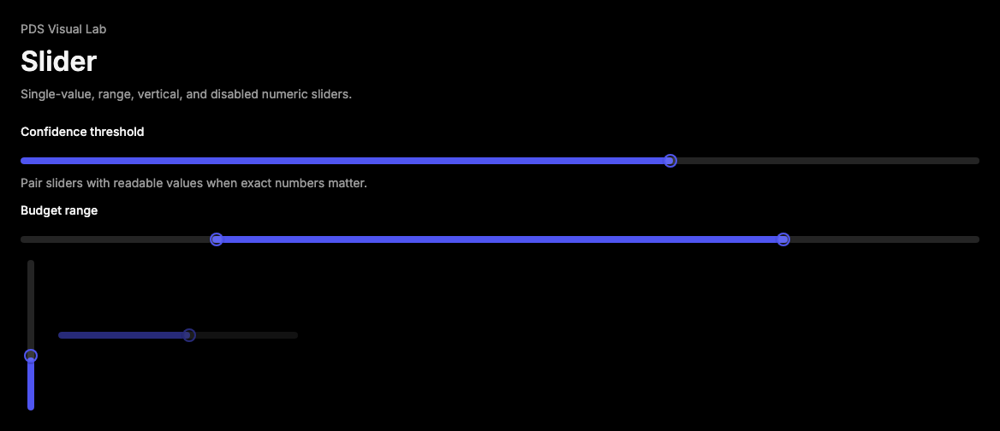

# Slider

## Purpose

Slider provides a tokenized Radix slider for numeric settings where users need
to adjust one value or a bounded range.



## When To Use

- Use for tunable numeric settings such as confidence thresholds, budget caps,
  sampling values, or range filters.
- Use range sliders when both lower and upper bounds matter.

## When Not To Use

- Do not use Slider when exact numeric entry is required without another input.
- Do not use Slider for binary settings; use Switch or Toggle.

## Anatomy / Slots

```tsx
<Slider aria-label="Confidence threshold" defaultValue={[70]} />
```

## Public API

Exports include `Slider` and `SliderProps`. Slider accepts Radix Slider root
props and renders track, range, and thumb slots.

| Prop | Values | Default | Notes |
| --- | --- | --- | --- |
| `value` | number array | `undefined` | Controlled values. |
| `defaultValue` | number array | `undefined` | Uncontrolled initial values. |
| `min` / `max` | number | `0` / `100` | Bounds passed to Radix. |
| `thumbLabel` | string | `Slider thumb` | Accessible name used for generated thumbs. |

## Data Attributes

| Attribute | Values | Owner |
| --- | --- | --- |
| `data-slot` | `slider`, `slider-track`, `slider-range`, `slider-thumb` | Component |
| `data-orientation` | `horizontal`, `vertical` | Radix |
| `data-disabled` | present when disabled | Radix |

## Accessibility Contract

Radix owns slider semantics and keyboard behavior. Consumers must provide a
label with `aria-label`, `aria-labelledby`, or visible field labeling.

## Content Resilience Rules

Slider is a visual control. Pair it with readable value text or an adjacent
number input when users need to inspect or enter exact values.

## Styling Contract

Classes use the `pds-slider-*` prefix. CSS depends on Radix orientation and
disabled data attributes.

## Token Usage

Uses spacing, color, radius, elevation, focus, disabled opacity, and motion
tokens.

## State Contract

| State | Trigger | Visual treatment | Data attribute / selector | Accessibility notes |
| --- | --- | --- | --- | --- |
| Default | Normal render | Horizontal track, accent range, and thumb. | `data-slot='slider'` | Label required from consumer. |
| Range | Multiple values | Multiple thumbs render with numbered labels. | repeated `data-slot='slider-thumb'` | Thumb labels include index. |
| Vertical | `orientation="vertical"` | Vertical track and range. | `data-orientation='vertical'` | Keyboard behavior remains Radix-owned. |
| Disabled | `disabled` | Slider dims and Radix suppresses interaction. | `data-disabled` | Disabled state must be paired with context when needed. |

Non-applicable states: Loading, Error, Success. Use surrounding Field or
feedback components for those states.

## State Behavior

Thumb count follows `value` or `defaultValue` length. Radix owns value updates,
keyboard handling, and hidden input behavior when used in forms.

## Composition Examples

```tsx
import { Field, FieldContent, FieldLabel, Slider } from "@pds/react";

<Field>
  <FieldLabel id="confidence-label">Confidence threshold</FieldLabel>
  <FieldContent>
    <Slider aria-labelledby="confidence-label" defaultValue={[70]} />
  </FieldContent>
</Field>
```

## Known Limitations

- Slider does not render value labels or numeric inputs.

## Do / Don't For Agents

Do:

- Provide a visible label and value text when exact values matter.

Don't:

- Do not use Slider as the only way to enter exact numeric values.

## Related Components

- [Field](field.md)
- [Input](input.md)
- [Switch](switch.md)

## Related Sources

- Component source: [packages/react/src/components/slider.tsx](../../../packages/react/src/components/slider.tsx)
