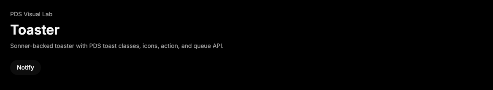

# Toaster

## Purpose

Toaster provides the Sonner-backed notification queue for PDS apps that need an
imperative `toast` API with PDS styling.



## When To Use

- Use when an app needs queued non-blocking notifications through Sonner.
- Use exported `toast` helpers for success, info, warning, error, loading, and
  promise feedback.
- Use the Radix [Toast](toast.md) component when the app needs fully controlled
  toast composition instead of a queue API.

## When Not To Use

- Do not use Toaster for required validation errors or blocking confirmation.
- Do not put durable audit state only in transient toasts.

## Anatomy / Slots

```tsx
<Toaster />
toast.success("Run queued");
```

Sonner renders the toast list and per-toast anatomy. PDS supplies class hooks
through `toastOptions.classNames`.

## Public API

| Export | Notes |
| --- | --- |
| `Toaster` | PDS configured Sonner toaster. |
| `toast` | Sonner imperative toast API. |
| `useSonner` | Sonner hook for reading queue state. |
| `ToasterProps` | Props from Sonner. |

| Prop | Values | Default | Notes |
| --- | --- | --- | --- |
| `position` | Sonner positions | `bottom-right` | Queue placement. |
| `closeButton` | boolean | `true` | Shows the Sonner close button. |
| `theme` | `light`, `dark`, `system` | `light` | Passed to Sonner. |

## Data Attributes

| Attribute | Values | Owner |
| --- | --- | --- |
| `data-sonner-toaster` | present | Sonner |
| `data-sonner-toast` | present | Sonner |
| `data-type` | Sonner toast type | Sonner |

PDS class hooks include `pds-toaster`, `pds-sonner-toast`,
`pds-sonner-title`, `pds-sonner-description`,
`pds-sonner-action-button`, `pds-sonner-cancel-button`, and
`pds-sonner-close-button`.

## Accessibility Contract

Sonner owns live-region announcements, hotkey focus, dismiss behavior, and
queue rendering. Consumers must provide concise localized messages and visible
text for actions. Do not rely on icon or tone alone.

## Content Resilience Rules

Toast titles, descriptions, actions, and cancel buttons wrap in narrow
containers. Use concise text because notifications are transient, but keep
required recovery instructions inline elsewhere.

## Styling Contract

Styles live in `packages/react/src/components.css` and override Sonner's styled
output through higher-specificity PDS selectors and CSS variables. Keep
`toastOptions.classNames` merged so consumers can add classes without removing
PDS hooks.

## Token Usage

Toaster uses PDS popover surface, status/accent colors, typography, spacing,
radius, elevation, focus, state layer, disabled opacity, and motion tokens.

## State Contract

| State | Trigger | Visual treatment | Data attribute / selector | Accessibility notes |
| --- | --- | --- | --- | --- |
| Default | Queued toast | Toast renders on popover surface with neutral accent. | `.pds-sonner-toast` | Sonner owns live region behavior. |
| Hover | Pointer hover on controls | Action, cancel, and close controls use hover state layers. | `.pds-sonner-*-button:hover` | Hover does not alter announcement semantics. |
| Focus-visible | Keyboard focus | Toast controls use shared PDS focus shadow. | `.pds-sonner-*-button:focus-visible` | Hotkey focus is Sonner-owned. |
| Active | Pressed controls | Action and cancel controls use pressed state layers. | `.pds-sonner-*-button:active` | Activation is app callback owned. |
| Disabled | Disabled action/cancel | Controls dim and suppress interaction. | `:disabled` | Disabled native controls are not activatable. |
| Error | `toast.error` | Danger accent. | `.pds-sonner-error` | Text must state the error. |
| Success | `toast.success` | Success accent. | `.pds-sonner-success` | Text must state the result. |
| Loading | `toast.loading` | Loading accent and spinning icon. | `.pds-sonner-loading` | Use only for transient async status. |

## State Behavior

Sonner owns queue state, mounting, swipe, duration, promise handling, and
dismissal. PDS sets default icons, close button, class names, and token-backed
variables.

## Composition Examples

```tsx
import { Toaster, toast } from "@pds/react";

<Toaster />;
toast.success("Run queued", {
  description: "Reviewers will be notified when it starts."
});
```

## Known Limitations

- Toaster does not replace inline validation, alerts, or confirmations.
- Toaster does not own app notification persistence.

## Do / Don't For Agents

Do:

- Render one `Toaster` per queue scope.
- Use concise visible text and semantic toast types.

Don't:

- Do not import `sonner` directly when using PDS defaults.
- Do not remove merged PDS class names from `toastOptions`.

## Related Components

- [Toast](toast.md)
- [Alert](alert.md)
- [InlineAlert](inline-alert.md)

## Related Sources

- Component source: [packages/react/src/components/sonner.tsx](../../../packages/react/src/components/sonner.tsx)
