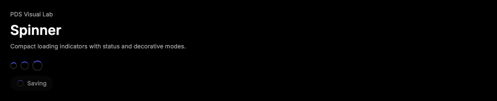

# Spinner

## Purpose

Spinner communicates an in-progress operation when the interface needs a compact
loading affordance rather than a full progress bar or skeleton layout.



## When To Use

- Use inside buttons, rows, empty states, or compact panels while an action is
  running.
- Use `decorative` when adjacent visible text already says what is loading.

## When Not To Use

- Do not use Spinner for known progress values; use Progress.
- Do not use Spinner as the only status signal for long-running work.

## Anatomy / Slots

```tsx
<Spinner label="Loading runs" />
```

## Public API

Exports include `Spinner`, `SpinnerProps`, and `SpinnerSize`.

| Prop | Values | Default | Notes |
| --- | --- | --- | --- |
| `size` | `sm`, `md`, `lg` | `md` | Controls the visual spinner size. |
| `label` | string | `Loading` | Accessible name when not decorative. |
| `decorative` | boolean | `false` | Hides the spinner from assistive technology. |

## Data Attributes

| Attribute | Values | Owner |
| --- | --- | --- |
| `data-slot` | `spinner` | Component |
| `data-size` | `sm`, `md`, `lg` | Component |

## Accessibility Contract

Spinner renders `role="status"` with an accessible label by default. Use
`decorative` only when nearby text already exposes the loading state.

## Content Resilience Rules

Spinner has no text slot. Pair it with readable status copy when users need to
understand what is happening.

## Styling Contract

The root class is `pds-spinner`. CSS owns the rotating visual, sizes, and
reduced-motion behavior.

## Token Usage

Uses spacing, color, radius, and motion tokens.

## State Contract

| State | Trigger | Visual treatment | Data attribute / selector | Accessibility notes |
| --- | --- | --- | --- | --- |
| Loading | Normal render | Animated circular progress affordance. | `data-slot='spinner'` | Announces as status unless decorative. |
| Decorative | `decorative` | Same visual treatment but hidden from accessibility APIs. | `aria-hidden='true'` | Use only with adjacent readable loading text. |

Non-applicable states: Hover, Focus-visible, Active, Disabled, Error, Success.
Use the surrounding control or region for those states.

## State Behavior

`decorative` removes the status role and accessible label. Reduced-motion CSS
shortens animation duration.

## Composition Examples

```tsx
import { Button, Spinner } from "@pds/react";

<Button disabled>
  <Spinner decorative size="sm" />
  Saving
</Button>
```

## Known Limitations

- Spinner does not render progress value text.

## Do / Don't For Agents

Do:

- Provide visible loading text for long-running operations.

Don't:

- Do not rely on spinner animation alone to describe a blocking state.

## Related Components

- [Progress](progress.md)
- [Skeleton](skeleton.md)
- [RunStatus](run-status.md)

## Related Sources

- Component source: [packages/react/src/components/spinner.tsx](../../../packages/react/src/components/spinner.tsx)
