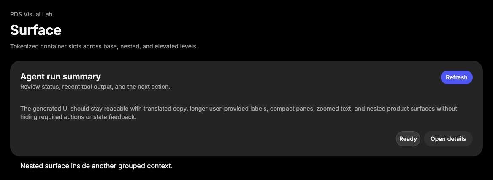

# Surface

## Purpose

Surface is the structural composition primitive for grouped PDS content. It
provides layered backgrounds, radius, spacing, header/content/footer slots, and
action placement without imposing application landmarks or data behavior.



## When To Use

- Use for grouped product modules, panels, run summaries, review blocks, and
  nested content areas.
- Use `level="base"` for a normal grouped module.
- Use `level="nested"` for grouped content inside another surface.
- Use `level="elevated"` when the surface needs additional hierarchy or overlay
  depth.

## When Not To Use

- Do not use Surface as a replacement for every layout `div`.
- Do not use Surface for tiny inline metadata; use [Badge](badge.md) or text.
- Do not add headings, landmarks, or application roles unless the consuming
  surface needs them.
- Do not create new surface levels without updating CSS, docs, examples, and
  tests.

## Anatomy / Slots

```tsx
<Surface>
  <SurfaceHeader>
    <SurfaceTitle />
    <SurfaceDescription />
    <SurfaceAction />
  </SurfaceHeader>
  <SurfaceContent />
  <SurfaceFooter />
</Surface>
```

Slots are optional, but this order is the expected composition when all are
present.

## Public API

| Export | Notes |
| --- | --- |
| `Surface` | Root `div`; accepts `level`. |
| `SurfaceHeader` | Header layout slot. |
| `SurfaceTitle` | Title text slot; renders `div`. |
| `SurfaceDescription` | Supporting text slot; renders `div`. |
| `SurfaceAction` | Header action slot. |
| `SurfaceContent` | Main content slot. |
| `SurfaceFooter` | Footer action or metadata slot. |

| Prop | Values | Default | Notes |
| --- | --- | --- | --- |
| `level` | `base`, `nested`, `elevated` | `base` | Root visual hierarchy. |

All exports forward refs, preserve `className`, and pass native attributes to
their rendered element.

## Data Attributes

| Attribute | Values | Owner |
| --- | --- | --- |
| `data-slot` | `surface` | `Surface` |
| `data-level` | `base`, `nested`, `elevated` | `Surface` |
| `data-slot` | `surface-header` | `SurfaceHeader` |
| `data-slot` | `surface-title` | `SurfaceTitle` |
| `data-slot` | `surface-description` | `SurfaceDescription` |
| `data-slot` | `surface-action` | `SurfaceAction` |
| `data-slot` | `surface-content` | `SurfaceContent` |
| `data-slot` | `surface-footer` | `SurfaceFooter` |

## Accessibility Contract

Surface is visually structural and renders neutral `div` elements by default.
Consumers own semantic roles, section labels, heading levels, and landmarks.

Use real heading elements around or inside Surface when the surrounding page
structure needs headings. Do not assume `SurfaceTitle` creates a document
heading.

## Content Resilience Rules

Surface title, description, content, actions, and footer should wrap in narrow
containers. Header and footer layouts are flexible and should adapt before
content is clipped.

Surface should remain boundless by default. Add fixed dimensions only in the
consumer when the surrounding product layout explicitly owns that constraint.

## Styling Contract

The root class is `pds-surface`; slot classes use the `pds-surface-*` prefix.
Styling lives in `packages/react/src/components.css`.

CSS depends on `data-level` for background and shadow treatment. Preserve slot
selectors because examples and future tests use them as stable structure hooks.

## Token Usage

Surface uses PDS surface color, spacing, radius, elevation, typography, and
content resilience rules. Choose levels by hierarchy and containment, not by
visual preference.

## State Contract

| State | Trigger | Visual treatment | Data attribute / selector | Accessibility notes |
| --- | --- | --- | --- | --- |
| Default | Normal render | Surface renders structural sections at the selected hierarchy level. | `data-slot='surface'`, `data-level` | Surface is structural; children own semantics. |

Non-applicable states: Hover, Focus-visible, Active, Disabled, Loading, Error, Success. Use child components or the surrounding region for those states when needed.

## State Behavior

Surface has no interactive state of its own. Interactive behavior belongs to
children such as Button. Nested hierarchy is expressed by `level`, not local
state.

## Composition Examples

```tsx
import {
  Button,
  Surface,
  SurfaceAction,
  SurfaceContent,
  SurfaceDescription,
  SurfaceFooter,
  SurfaceHeader,
  SurfaceTitle
} from "@pds/react";

<Surface level="elevated">
  <SurfaceHeader>
    <SurfaceTitle>Agent run summary</SurfaceTitle>
    <SurfaceDescription>Review status and recent tool output.</SurfaceDescription>
    <SurfaceAction>
      <Button size="sm">Refresh</Button>
    </SurfaceAction>
  </SurfaceHeader>
  <SurfaceContent>Messages and metadata</SurfaceContent>
  <SurfaceFooter>
    <Button intent="secondary">Open details</Button>
    <Button>Approve</Button>
  </SurfaceFooter>
</Surface>
```

## Known Limitations

- Surface does not provide disclosure, loading, selection, or drag behavior.
- Surface does not create headings or landmarks automatically.
- Surface does not enforce a specific footer action order.

## Do / Don't For Agents

Do:

- Preserve slot exports and `data-slot` values.
- Keep Surface structural and token-first.
- Use nested surfaces only when hierarchy or grouping needs another layer.
- Update examples and CSS contract tests when changing slot behavior.

Don't:

- Do not add new component APIs for product-specific content.
- Do not add one-off borders where spacing, radius, or surface contrast can
  solve the hierarchy.
- Do not turn Surface into a card system with unrelated variants.
- Do not duplicate token values from `DESIGN.md`.

## Related Components

- [Button](button.md)
- [Message](message.md)
- [Composer](composer.md)

## Related Sources

- Component source: [packages/react/src/components/surface.tsx](../../../packages/react/src/components/surface.tsx)
