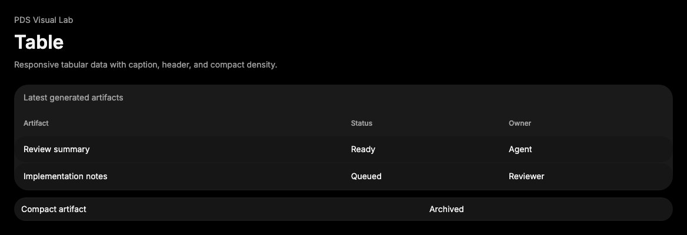

# Table

## Purpose

Table provides semantic tabular data primitives with PDS density and surface
styling.



## When To Use

- Use for row-and-column data where headers define cell meaning.
- Use `density="compact"` for dense operational tables.

## When Not To Use

- Do not use Table for key-value metadata; use DataList.
- Do not use for card grids or non-tabular layouts.

## Anatomy / Slots

```tsx
<TableContainer>
  <Table>
    <TableHeader />
    <TableBody />
  </Table>
</TableContainer>
```

## Public API

Exports include `TableContainer`, `Table`, `TableHeader`, `TableBody`,
`TableFooter`, `TableRow`, `TableHead`, `TableCell`, and `TableCaption`.
`Table` accepts `density="default" | "compact"`.

## Data Attributes

| Attribute | Values | Owner |
| --- | --- | --- |
| `data-slot` | `table-container`, `table`, `table-header`, `table-body`, `table-footer`, `table-row`, `table-head`, `table-cell`, `table-caption` | Component |
| `data-density` | `default`, `compact` | `Table` |

## Accessibility Contract

Components render native table elements. Consumers own meaningful captions,
header scope, sorting controls, and any ARIA annotations.

## Content Resilience Rules

Cells wrap by default. `TableContainer` provides horizontal overflow for narrow
viewports and zoom.

## Styling Contract

Classes use the `pds-table-*` prefix. CSS depends on density and native table
structure.

## Token Usage

Uses surface color, typography, spacing, radius, elevation, and state layer
tokens.

## State Contract

| State | Trigger | Visual treatment | Data attribute / selector | Accessibility notes |
| --- | --- | --- | --- | --- |
| Default | Normal render | Table renders container, semantic table sections, rows, cells, and caption at selected density. | `data-slot='table-*'`, `data-density` | Use native table semantics for tabular data. |
| Hover | Pointer hover | Rows apply a neutral hover layer to cells. | `.pds-table-row:hover .pds-table-cell` | Hover does not imply row selection. |

Non-applicable states: Focus-visible, Active, Disabled, Loading, Error, Success. Use child components or the surrounding region for those states when needed.

## State Behavior

Rows receive a neutral hover layer. Sorting, selection, and virtualization are
consumer-owned.

## Composition Examples

```tsx
import { Table, TableBody, TableCell, TableContainer, TableHead, TableHeader, TableRow } from "@pds/react";

<TableContainer>
  <Table>
    <TableHeader><TableRow><TableHead>Status</TableHead></TableRow></TableHeader>
    <TableBody><TableRow><TableCell>Running</TableCell></TableRow></TableBody>
  </Table>
</TableContainer>
```

## Known Limitations

- Table does not provide sorting, selection, resizing, or virtualization.

## Do / Don't For Agents

Do:

- Preserve native table semantics.

Don't:

- Do not replace semantic headers with generic divs.

## Related Components

- [DataList](data-list.md)
- [Pagination](pagination.md)

## Related Sources

- Component source: [packages/react/src/components/table.tsx](../../../packages/react/src/components/table.tsx)
