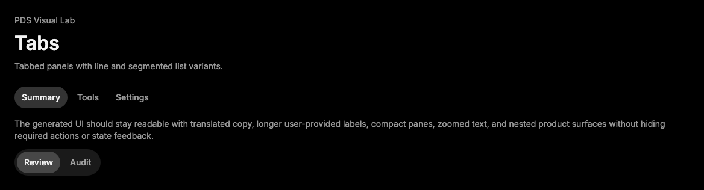

# Tabs

## Purpose

Tabs provides same-page view switching backed by Radix Tabs. `TabsList` can use
line or segmented visual treatment.



## When To Use

- Use for peer views within one surface.
- Use `variant="segmented"` for compact mode controls.

## When Not To Use

- Do not use for page navigation; use app routing or Breadcrumbs.
- Do not hide required form content behind tabs unless the product flow handles
  validation clearly.

## Anatomy / Slots

```tsx
<Tabs defaultValue="activity">
  <TabsList>
    <TabsTrigger value="activity">Activity</TabsTrigger>
  </TabsList>
  <TabsContent value="activity">Runs</TabsContent>
</Tabs>
```

## Public API

| Export | Notes |
| --- | --- |
| `Tabs`, `TabsList`, `TabsTrigger`, `TabsContent` | Styled Radix slots. |

`TabsList` accepts `variant="line" | "segmented"`.

## Data Attributes

| Attribute | Values | Owner |
| --- | --- | --- |
| `data-slot` | `tabs`, `tabs-list`, `tabs-trigger`, `tabs-content` | Component |
| `data-variant` | `line`, `segmented` | `TabsList` |
| `data-state` | `active`, `inactive` | Radix |

## Accessibility Contract

Radix owns tablist/tab/tabpanel semantics, roving focus, and keyboard behavior.
Consumers must keep tab labels meaningful.

## Content Resilience Rules

Tab labels wrap and the list scrolls horizontally when constrained. Content
panels remain boundless by default.

## Styling Contract

Classes use the `pds-tabs-*` prefix. CSS depends on list variant, active state,
hover, focus-visible, and disabled selectors.

## Token Usage

Uses color, spacing, radius, typography, focus, state layer, segmented surface,
and motion tokens.

## State Contract

| State | Trigger | Visual treatment | Data attribute / selector | Accessibility notes |
| --- | --- | --- | --- | --- |
| Default | Normal render | Tabs render list, triggers, and content with line or segmented list treatment. | `data-slot='tabs-*'`, `data-variant` | Radix owns tablist, tab, and tabpanel semantics. |
| Hover | Pointer hover | Enabled triggers use neutral hover treatment. | `.pds-tabs-trigger:not(:disabled):hover` | Hover does not change selected tab. |
| Focus-visible | Keyboard focus | Tab triggers use shared PDS focus shadow. | `.pds-tabs-trigger:focus-visible` | Keyboard navigation follows Radix tabs behavior. |
| Active | Pressed | Active trigger uses selected treatment; segmented active trigger uses segmented selected surface. | `data-state='active'`, `.pds-tabs-trigger[data-state='active']` | Radix updates selected tab and tabpanel relationship. |
| Disabled | `disabled` / `aria-disabled` | Disabled triggers dim and suppress hover treatment. | `.pds-tabs-trigger:disabled` | Radix disabled tabs are not activatable. |

Non-applicable states: Loading, Error, Success. Use child components or the surrounding region for those states when needed.

## State Behavior

Active triggers use selected state treatment. Segmented lists use segmented
surface and active tokens.

## Composition Examples

```tsx
import { Tabs, TabsContent, TabsList, TabsTrigger } from "@pds/react";

<Tabs defaultValue="runs">
  <TabsList variant="segmented">
    <TabsTrigger value="runs">Runs</TabsTrigger>
    <TabsTrigger value="settings">Settings</TabsTrigger>
  </TabsList>
  <TabsContent value="runs">Recent runs</TabsContent>
  <TabsContent value="settings">Automation settings</TabsContent>
</Tabs>
```

## Known Limitations

- Tabs does not provide animated panel transitions.

## Do / Don't For Agents

Do:

- Keep tabs for local peer views.

Don't:

- Do not use tabs for route breadcrumbs or unrelated destinations.

## Related Components

- [Select](select.md)
- [Breadcrumbs](breadcrumbs.md)

## Related Sources

- Component source: [packages/react/src/components/tabs.tsx](../../../packages/react/src/components/tabs.tsx)
