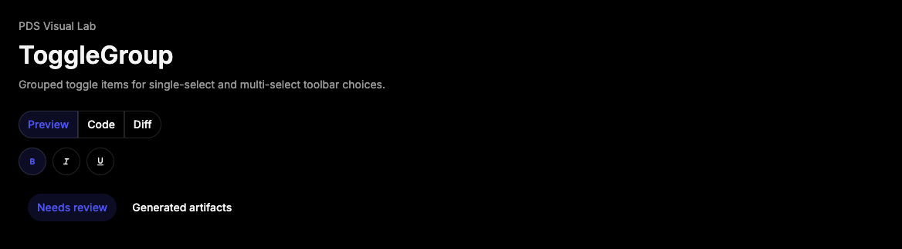

# ToggleGroup

## Purpose

ToggleGroup groups related toggle items for mutually exclusive or multi-select
toolbar choices while sharing PDS size, variant, and spacing treatment.



## When To Use

- Use for compact mode choices, formatting controls, and small segmented action
  sets.
- Use `type="single"` for one selected option and `type="multiple"` for
  independent options in one group.

## When Not To Use

- Do not use ToggleGroup for page navigation; use Tabs or Breadcrumbs.
- Do not use ToggleGroup for binary setting rows with helper text; use Switch
  inside Field.

## Anatomy / Slots

```tsx
<ToggleGroup type="single" defaultValue="preview">
  <ToggleGroupItem value="preview">Preview</ToggleGroupItem>
</ToggleGroup>
```

## Public API

Exports include `ToggleGroup`, `ToggleGroupItem`, `ToggleGroupProps`,
`ToggleGroupItemProps`, and `ToggleGroupSpacing`.

| Prop | Values | Default | Notes |
| --- | --- | --- | --- |
| `type` | `single`, `multiple` | required by Radix | Controls selection model. |
| `size` | `sm`, `md`, `lg`, `icon` | `md` | Shared item size. |
| `variant` | `default`, `outline` | `default` | Shared item variant. |
| `spacing` | `joined`, `separated` | `joined` | Controls item grouping. |

## Data Attributes

| Attribute | Values | Owner |
| --- | --- | --- |
| `data-slot` | `toggle-group`, `toggle-group-item` | Component |
| `data-size` | `sm`, `md`, `lg`, `icon` | Component |
| `data-variant` | `default`, `outline` | Component |
| `data-spacing` | `joined`, `separated` | Component |
| `data-state` | `on`, `off` | Radix item |

## Accessibility Contract

Radix owns roving focus and toggle group semantics. Consumers must provide an
accessible group name with `aria-label` or `aria-labelledby`, and accessible
names for icon-only items.

## Content Resilience Rules

Items wrap as a group when space is constrained. Keep labels concise and avoid
placing long explanatory text inside the item.

## Styling Contract

Classes use `pds-toggle-group` and `pds-toggle-group-item`. Items also receive
the `pds-toggle` class so Toggle and ToggleGroup share state styling.

## Token Usage

Uses the same typography, spacing, radius, color, focus, selected state,
disabled opacity, and motion tokens as Toggle.

## State Contract

| State | Trigger | Visual treatment | Data attribute / selector | Accessibility notes |
| --- | --- | --- | --- | --- |
| Joined | `spacing="joined"` | Items connect into one segmented group. | `data-spacing='joined'` | Group label remains consumer-owned. |
| Separated | `spacing="separated"` | Items keep individual rounded surfaces. | `data-spacing='separated'` | Useful for wrapping toolbars. |
| Selected | Item selected by Radix | Item uses Toggle selected treatment. | `data-state='on'` | Radix exposes pressed state. |
| Disabled | Group or item disabled | Disabled item dims and suppresses interaction. | `data-disabled`, `:disabled` | Disabled behavior is Radix-owned. |

Non-applicable states: Loading, Error, Success. Use surrounding Field or
feedback components for those states.

## State Behavior

ToggleGroup passes shared size, variant, and spacing to items through context.
Item-level size or variant props override group defaults.

## Composition Examples

```tsx
import { ToggleGroup, ToggleGroupItem } from "@pds/react";

<ToggleGroup aria-label="View mode" defaultValue="preview" type="single">
  <ToggleGroupItem value="preview">Preview</ToggleGroupItem>
  <ToggleGroupItem value="code">Code</ToggleGroupItem>
</ToggleGroup>
```

## Known Limitations

- ToggleGroup does not render labels, tooltips, or overflow menus.

## Do / Don't For Agents

Do:

- Label the group and icon-only items.

Don't:

- Do not use ToggleGroup as primary page navigation.

## Related Components

- [Toggle](toggle.md)
- [Tabs](tabs.md)
- [Button](button.md)

## Related Sources

- Component source: [packages/react/src/components/toggle-group.tsx](../../../packages/react/src/components/toggle-group.tsx)
