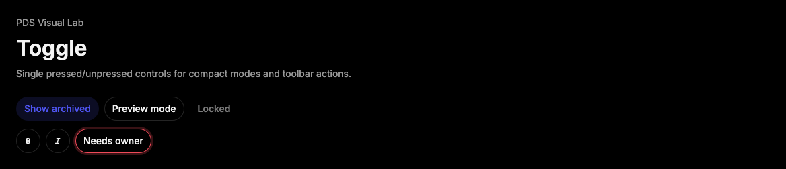

# Toggle

## Purpose

Toggle provides a single pressed/unpressed control for compact mode switches,
formatting actions, and filter-like choices.



## When To Use

- Use for a single independently toggled mode or setting.
- Use `variant="outline"` when the toggle needs a visible container in a dense
  toolbar.

## When Not To Use

- Do not use Toggle for mutually exclusive sets; use ToggleGroup or Tabs.
- Do not use Toggle for persistent binary settings with explanatory text; use
  Switch.

## Anatomy / Slots

```tsx
<Toggle aria-label="Show archived" pressed={showArchived} />
```

## Public API

Exports include `Toggle`, `ToggleProps`, `ToggleSize`, and `ToggleVariant`.
Toggle accepts Radix Toggle root props and forwards refs.

| Prop | Values | Default | Notes |
| --- | --- | --- | --- |
| `size` | `sm`, `md`, `lg`, `icon` | `md` | Controls dimensions and padding. |
| `variant` | `default`, `outline` | `default` | Controls neutral or outlined treatment. |
| `invalid` | boolean | `false` | Adds invalid state and `aria-invalid`. |

## Data Attributes

| Attribute | Values | Owner |
| --- | --- | --- |
| `data-slot` | `toggle` | Component |
| `data-size` | `sm`, `md`, `lg`, `icon` | Component |
| `data-variant` | `default`, `outline` | Component |
| `data-invalid` | `true` when invalid | Component |
| `data-state` | `on`, `off` | Radix |

## Accessibility Contract

Radix owns pressed button semantics. Icon-only toggles require an accessible
name through `aria-label` or `aria-labelledby`.

## Content Resilience Rules

Toggle labels are single-line. Keep text concise and move supporting context to
surrounding Field, Tooltip, or toolbar text.

## Styling Contract

The root class is `pds-toggle`. CSS depends on size, variant, invalid,
disabled, focus-visible, and Radix `data-state`.

## Token Usage

Uses typography, spacing, radius, color, focus, invalid, disabled opacity,
state-layer, and motion tokens.

## State Contract

| State | Trigger | Visual treatment | Data attribute / selector | Accessibility notes |
| --- | --- | --- | --- | --- |
| Off | Default Radix state | Neutral button treatment. | `data-state='off'` | Button name must describe the action or mode. |
| On | Pressed Radix state | Accent selected treatment. | `data-state='on'` | Pressed state is exposed by Radix. |
| Focus-visible | Keyboard focus | Shared PDS focus shadow. | `.pds-toggle:focus-visible` | Focus remains on the button. |
| Disabled | `disabled` | Toggle dims and suppresses interaction. | `:disabled`, `data-disabled` | Disabled behavior is Radix-owned. |
| Error | `invalid` or `aria-invalid` | Invalid ring and danger stroke. | `aria-invalid='true'` | Pair with visible error text when used in forms. |

Non-applicable states: Loading, Success. Use child content or surrounding
feedback for those states.

## State Behavior

Radix owns pressed state and keyboard behavior. `invalid` maps to
`aria-invalid` unless an explicit ARIA invalid value is provided.

## Composition Examples

```tsx
import { Icon, Toggle } from "@pds/react";

<Toggle aria-label="Show archived" variant="outline">
  <Icon name="inventory_2" />
</Toggle>
```

## Known Limitations

- Toggle does not render tooltips or shortcut labels.

## Do / Don't For Agents

Do:

- Provide accessible names for icon-only toggles.

Don't:

- Do not use ToggleGroup behavior with independent Toggle components.

## Related Components

- [ToggleGroup](toggle-group.md)
- [Switch](switch.md)
- [Tabs](tabs.md)

## Related Sources

- Component source: [packages/react/src/components/toggle.tsx](../../../packages/react/src/components/toggle.tsx)
