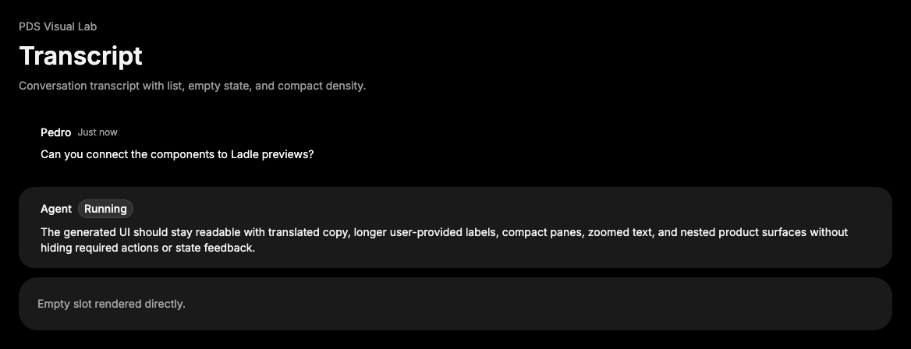

# Transcript

## Purpose

Transcript is the PDS conversation container primitive. It owns transcript
section structure, density, message list spacing, and empty state layout without
fetching, ordering, streaming, or virtualizing messages.



## When To Use

- Use around Message collections in conversation-like product surfaces.
- Use `TranscriptList` for the ordered visual stack of messages.
- Use `empty` or `TranscriptEmpty` for empty conversation states.
- Use `density="compact"` when the surrounding surface needs denser transcript
  spacing.

## When Not To Use

- Do not use Transcript as a generic stack or panel.
- Do not put fetching, sorting, grouping, streaming, or virtualization logic in
  Transcript.
- Do not rely on Transcript to create live-region announcements.

## Anatomy / Slots

```tsx
<Transcript>
  <TranscriptList>
    <Message />
  </TranscriptList>
</Transcript>
```

```tsx
<Transcript empty="No messages yet" />
```

## Public API

| Export | Notes |
| --- | --- |
| `Transcript` | Root `section`; accepts `density` and `empty`. |
| `TranscriptList` | Message stack slot. |
| `TranscriptEmpty` | Empty-state slot. |

| Prop | Values | Default | Notes |
| --- | --- | --- | --- |
| `density` | `default`, `compact` | `default` | Controls transcript spacing. |
| `empty` | `ReactNode` | `undefined` | Rendered through `TranscriptEmpty` when no children exist. |

All exports forward refs, preserve `className`, and pass native attributes to
their rendered element.

## Data Attributes

| Attribute | Values | Owner |
| --- | --- | --- |
| `data-slot` | `transcript` | `Transcript` |
| `data-density` | `default`, `compact` | `Transcript` |
| `data-slot` | `transcript-list` | `TranscriptList` |
| `data-slot` | `transcript-empty` | `TranscriptEmpty` |

## Accessibility Contract

Transcript renders a `section`. Consumers own `aria-label`, `aria-labelledby`,
heading structure, live-region behavior, message ordering semantics, and
keyboard navigation.

`empty` content is rendered only when `children` count is zero. Consumers own any
copy required to explain the empty state.

## Content Resilience Rules

Transcript is boundless by default and should grow with message content, empty
state copy, generated identifiers, and translated strings. It must not impose a
fixed height in package CSS.

## Styling Contract

Classes use the `pds-transcript-*` prefix; styling lives in
`packages/react/src/components.css`.

CSS depends on `data-density` for compact spacing. Preserve the no-fixed-height
contract and wrapping behavior when changing selectors.

## Token Usage

Transcript uses PDS spacing, typography, surface color, and content resilience
rules. Message role styling belongs to Message, not Transcript.

## State Contract

| State | Trigger | Visual treatment | Data attribute / selector | Accessibility notes |
| --- | --- | --- | --- | --- |
| Default | Normal render | Transcript renders list content or the empty slot at selected density. | `data-slot='transcript'`, `data-density` | Children define message semantics; empty text must be readable. |

Non-applicable states: Hover, Focus-visible, Active, Disabled, Loading, Error, Success. Use child components or the surrounding region for those states when needed.

## State Behavior

Transcript has minimal render state: if it receives children, it renders them;
otherwise it renders `empty` through `TranscriptEmpty` when provided. It does not
auto-scroll, stream, or virtualize.

## Composition Examples

```tsx
import { Message, MessageContent, Transcript, TranscriptList } from "@pds/react";

<Transcript aria-label="Conversation" empty="No messages yet">
  <TranscriptList>
    <Message role="assistant">
      <MessageContent>Ready.</MessageContent>
    </Message>
  </TranscriptList>
</Transcript>
```

## Known Limitations

- Transcript does not fetch, sort, group, or persist messages.
- Transcript does not auto-scroll or virtualize.
- Transcript does not create live regions.

## Do / Don't For Agents

Do:

- Preserve the root `section` and slot attributes.
- Keep transcript layout boundless by default.
- Compose messages with [Message](message.md) rather than adding message logic.

Don't:

- Do not add streaming, persistence, or virtualization here.
- Do not impose fixed transcript heights in package CSS.
- Do not make empty state copy mandatory.

## Related Components

- [Message](message.md)
- [Composer](composer.md)
- [RunStatus](run-status.md)

## Related Sources

- Component source: [packages/react/src/components/transcript.tsx](../../../packages/react/src/components/transcript.tsx)
